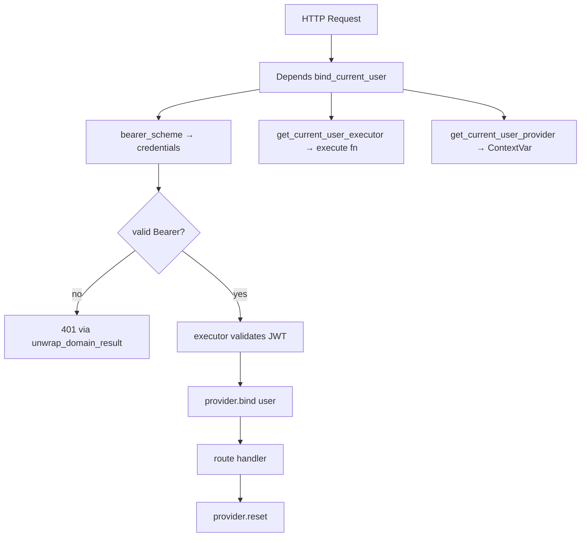
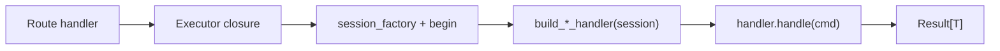

# Python / FastAPI learning notes

Notes from working through layers in this project.

---

## Authentication system design

Canonical file layout and import rules: [TECHNICAL_REQUIREMENTS.md](TECHNICAL_REQUIREMENTS.md) §3.4. Auth gates live in `backend/app/api/dependencies.py`; all executor creators (including `get_current_user_executor`, used by `bind_current_user`) live under `backend/app/api/executors/` (one file per use case). Routers still import executor symbols from `..dependencies` via re-exports.

### `GetCurrentUserExecutor` — reading the brackets

File: `backend/app/api/executors/current_user.py` (routers and auth gates import `GetCurrentUserExecutor` and `get_current_user_executor` from `backend/app/api/dependencies.py`)

```python
GetCurrentUserExecutor = Callable[
    [CurrentUserQuery], Awaitable[Result[CurrentUser]]
]
```

Read it **from the inside out**:

| Piece | Meaning |
|---|---|
| `CurrentUser` | Domain object: authenticated user |
| `Result[CurrentUser]` | Success with a user, or failure with an error code |
| `Awaitable[...]` | You must `await` it — it's async |
| `[CurrentUserQuery]` | One argument: the query object (holds the JWT token) |
| `Callable[[...], ...]` | "A function you can call" |

In plain English:

> **A callable that takes a `CurrentUserQuery` and, when awaited, returns `Result[CurrentUser]`.**

That matches the inner function in `get_current_user_executor`:

```python
async def execute(query: CurrentUserQuery) -> Result[CurrentUser]:
    async with request.app.state.session_factory() as session:
        handler = build_get_current_user_handler(session, request.app.state.settings)
        return await handler.handle(query)
```

`Callable` always uses **two** bracket groups:

```python
Callable[[arg1_type, arg2_type], return_type]
#         ^^^^^^^^^^^^^^^^^^^^^^^^  ^^^^^^^^^^^
#         "what you pass in"        "what you get back"
```

Why not just write `async def ...` inline? The alias names the **shape** of the injected dependency so `bind_current_user` can declare `executor: GetCurrentUserExecutor` without repeating the full generic.

---

### `bind_current_user` — where do those parameters come from?

File: `backend/app/api/dependencies.py`

They are **not** passed by the HTTP client. FastAPI builds them via **dependency injection**: it inspects the function signature and resolves each `Depends(...)` before your route runs.

```python
async def bind_current_user(
    credentials: Annotated[
        HTTPAuthorizationCredentials | None, Depends(bearer_scheme)
    ],
    executor: Annotated[
        GetCurrentUserExecutor, Depends(get_current_user_executor)
    ],
    provider: Annotated[
        ContextVarCurrentUserProvider,
        Depends(get_current_user_provider),
    ],
) -> AsyncIterator[None]:
    ...
    token = provider.bind(current_user)
    try:
        yield
    finally:
        provider.reset(token)
```

Resolution chain:

```
HTTP request
    │
    ├─► bearer_scheme (HTTPBearer)        → parses Authorization: Bearer <token>
    │                                          → credentials (or None)
    │
    ├─► get_current_user_executor(Request)  → returns the async execute() closure
    │                                          (with session/request wired in)
    │
    └─► get_current_user_provider()         → singleton ContextVarCurrentUserProvider
```

What the function does:

1. Reject missing/non-Bearer auth.
2. Call `executor(CurrentUserQuery(token=...))` to validate JWT + session.
3. `provider.bind(current_user)` — store user in a `ContextVar` for this request.
4. **`yield`** — hand off to the route handler (or next dependency).
5. **`finally: provider.reset(token)`** — clean up after the request.

The `yield` makes this a **generator dependency**: code before `yield` runs on the way in; code after (here, in `finally`) runs on the way out. That's why the return type is `AsyncIterator[None]` — it yields nothing useful; the side effect (bind/reset) is the point.

`HTTPBearer(auto_error=False)` means a missing header does **not** auto-raise 401; this function checks credentials itself and maps failure through the domain `Result`.

---

### `Annotated[..., Depends(...)]` — what's going on?

File: `backend/app/api/dependencies.py`

Two layers in one annotation:

```python
credentials: Annotated[HTTPAuthorizationCredentials | None, Depends(bearer_scheme)]
#                      ^^^^^^^^^^^^^^^^^^^^^^^^^^^^^^^^^^^^^  ^^^^^^^^^^^^^^^^^^^^^
#                      real Python type (for type checkers)   FastAPI metadata (how to inject)
```

Older equivalent:

```python
credentials: HTTPAuthorizationCredentials | None = Depends(bearer_scheme)
```

Same behavior; `Annotated` keeps **type** and **injection rule** separate — better for mypy/pyright and the modern FastAPI style.

FastAPI reads `Depends(...)` and knows: "Don't take this from the query/body/path — call this function (or use this security scheme) to produce the value."

Nested `Depends` also chains: `get_current_user_executor` needs `Request`; FastAPI injects `Request` into it automatically because `Request` is a known special parameter.

---

### `dependencies=[Depends(bind_current_user)]` on a route

From `backend/app/api/routers/health.py`:

```python
@router.get(
    "/authenticated",
    dependencies=[Depends(bind_current_user)],
)
async def health_authenticated() -> dict[str, str]:
    return {"status": "ok"}
```

This attaches `bind_current_user` at the **route decorator** level.

Two ways to use a dependency in FastAPI:

| Style | Example | Effect |
|---|---|---|
| Parameter | `async def foo(user: CurrentUser = Depends(...))` | Runs dependency **and** passes return value into the handler |
| Route `dependencies=` | `dependencies=[Depends(bind_current_user)]` | Runs dependency **only**; return value is **not** passed to the handler |

Here the handler doesn't need `CurrentUser` in its signature — it only needs auth to succeed. If auth fails, `unwrap_domain_result` raises before the handler runs. If it passes, the handler returns `{"status": "ok"}`.

Flow:

```
GET /health/authenticated + Authorization: Bearer ...
        │
        ▼
bind_current_user runs (before handler)
        │ validate token, bind user to ContextVar
        ▼
health_authenticated() runs
        │
        ▼
bind_current_user cleanup (finally: reset ContextVar)
        │
        ▼
response sent
```

`/health/live` has **no** such dependency — no auth required.

---

### `POST /auth/logout` — two `Depends` on one route

File: `backend/app/api/routers/auth.py`

```python
@router.post(
    "/logout",
    status_code=status.HTTP_204_NO_CONTENT,
    dependencies=[Depends(bind_current_user)],
)
async def logout(
    executor: Annotated[LogoutExecutor, Depends(get_logout_executor)],
) -> Response:
    result = await executor(LogoutCommand())
    unwrap_domain_result(result)
    return Response(status_code=status.HTTP_204_NO_CONTENT)
```

This route uses **two** dependency mechanisms. They look similar but do different jobs.

| # | Where | Dependency | What it does |
|---|---|---|---|
| 1 | `dependencies=[Depends(bind_current_user)]` on the decorator | Auth gate + request context | Validates Bearer token, loads `CurrentUser`, stores it in a `ContextVar`, cleans up in `finally` |
| 2 | `executor: Annotated[..., Depends(get_logout_executor)]` on the handler parameter | Command executor | Returns the async closure that opens a DB transaction and runs `LogoutHandler` |

#### Why not one `Depends`?

Each dependency answers a different question:

- **`bind_current_user`** — *"Is this request authenticated, and who is the caller?"*
- **`get_logout_executor`** — *"How do I run the logout command for this HTTP request?"*

They must run in order: auth and binding happen **before** the handler body. The handler then calls `executor(LogoutCommand())`, and the domain handler reads `session_jti` through `CurrentUserProvider.get()` — not from a route parameter.

That separation is intentional hexagonal design: the route never sees `CurrentUser`, `session_jti`, or the raw JWT. Auth binding is an incoming-adapter concern; command execution is composition wiring.

#### Why `bind_current_user` is on the decorator, not a parameter

`bind_current_user` yields `None` — its value is useless to the handler. The handler only needs the **side effect** (user bound in the `ContextVar`).

Putting it in `dependencies=[...]` on the decorator:

- runs it as a gate before the handler;
- avoids a dummy parameter like `_auth: Annotated[None, Depends(bind_current_user)]`;
- matches `/health/authenticated`, which uses the same pattern.

`get_logout_executor` **does** produce something the handler uses (the callable), so it belongs as a **parameter** dependency.

#### Execution order

```
POST /auth/logout + Authorization: Bearer ...
        │
        ▼
bind_current_user (route dependency)
        │ parse Bearer → validate JWT + session
        │ provider.bind(current_user)  ← LogoutHandler reads this later
        ▼
get_logout_executor (parameter dependency)
        │ returns execute() closure wired to Request + session_factory
        ▼
logout() handler body
        │ executor(LogoutCommand())
        │   └─► build_logout_handler(..., get_current_user_provider())
        │       └─► LogoutHandler.handle() → revoke session_jti
        ▼
bind_current_user finally: provider.reset()
        │
        ▼
204 No Content
```

Note: `bind_current_user` and `get_logout_executor` each open their **own** short-lived DB session. That is safe here because logout uses a guarded `UPDATE` (`revoked_at IS NULL AND expires_at > :now`); even if auth read and revoke write are separate transactions, the write still fails cleanly when the session is already invalid.

#### Compared to OTP routes

`/auth/otp/request` and `/auth/otp/verify` have **no** auth dependency — they are public. Only logout (and authenticated health) combine route-level auth binding with handler-level executors.

---

### Big picture



**Summary:**

- `GetCurrentUserExecutor` = "async function(query) → Result[user]".
- `bind_current_user`'s parameters come from FastAPI's DI, not the client.
- `Annotated[..., Depends(...)]` splits type vs injection.
- `dependencies=[...]` on the route runs auth as a gate without adding parameters to the handler.
- Logout uses **two** dependencies: decorator-level `bind_current_user` (auth + ContextVar side effect) and parameter-level `get_logout_executor` (injected command runner).

---

## Executor vs handler analysis

Review question from Phase 5a: could routers inject a domain **handler** and call `handler.handle(Command)` directly, instead of injecting an **executor** closure and calling `await executor(Command())`?

Short answer: **yes, functionally equivalent alternatives exist.** The executor pattern is an intentional API-adapter choice from Phase 2, not a FastAPI requirement. The extra indirection wraps the same `handler.handle(cmd)` call with per-invocation DB session/transaction management.

### What an executor actually is

An executor is **not** an object with an `.execute()` method. It is an async **closure** returned by `get_*_executor`, typed as a `Callable`:

File: `backend/app/api/executors/exchange.py` (routers import `ExchangeExecutor` and `get_exchange_executor` from `backend/app/api/dependencies.py`)

```python
ExchangeExecutor = Callable[[ExchangeCommand], Awaitable[Result[ExchangeResult]]]


def get_exchange_executor(request: Request) -> ExchangeExecutor:
    async def execute(command: ExchangeCommand) -> Result[ExchangeResult]:
        async with request.app.state.session_factory() as session, session.begin():
            handler = build_exchange_handler(
                session,
                get_current_user_provider(),
            )
            return await handler.handle(command)

    return execute
```

Routers call it like a function: `await executor(ExchangeCommand(...))`.

The call stack:

```
Route handler
    └─► executor(command)           ← API adapter closure
            └─► session_factory()     ← open session (+ begin for writes)
                    └─► build_*_handler(session, ...)
                            └─► handler.handle(command)   ← domain logic
                                    └─► Result[T]
```

Domain handlers (`ExchangeHandler`, `UserBalancesHandler`, etc.) hold all business logic. The executor's only extra job is opening/closing the DB session and starting a transaction when needed.

### Could we inject the handler directly?

Yes. A yield-based FastAPI dependency can manage the session and expose the handler:

```python
# api/dependencies.py (alternative)
async def get_exchange_handler(request: Request) -> AsyncIterator[ExchangeHandler]:
    async with request.app.state.session_factory() as session, session.begin():
        yield build_exchange_handler(session, get_current_user_provider())


# api/routers/wallet.py (alternative)
async def create_exchange(
    body: ExchangeRequest,
    handler: Annotated[ExchangeHandler, Depends(get_exchange_handler)],
) -> WalletMutationResponse:
    data = unwrap_domain_result(
        await handler.handle(
            ExchangeCommand(
                source_asset_label=body.source_asset,
                destination_asset_label=body.destination_asset,
                amount_str=body.amount,
            )
        )
    )
    return WalletMutationResponse(id=data.transaction_id, type="EXCHANGE")
```

FastAPI's yield dependency keeps the session open for the route body and closes/commits (or rolls back) in the `finally` block — the same lifecycle guarantee as today.

For typical one-shot routes (call handler once, return response), this is equivalent to the executor closure.

### Why executors were chosen

These are design choices, not hard constraints:

| Reason | Explanation |
|---|---|
| Transaction boundary at API layer | `TECHNICAL_REQUIREMENTS.md` §6.2: the "command executor" owns `session.begin()`. Domain handlers never see SQLAlchemy sessions — only repository ports wired with a shared session. |
| Lazy per-invocation session | Session opens when you *call* the executor, not when FastAPI resolves dependencies. With yield-handler injection the session opens slightly earlier (at dependency entry), but for one-shot routes this is equivalent. |
| Reusable callable in auth deps | `bind_current_user` injects `GetCurrentUserExecutor` and calls it before the route runs — same session-wrapped logic without importing `CurrentUserHandler` into the auth binding. |
| Thin router coupling | Routers depend on `Callable[[Cmd], Result[T]]` aliases, not domain handler classes. Minor decoupling — routers still import commands and result types from domain. |
| Phase 2 precedent | Phase 2 docs prescribed executors; Phases 4–5 copied the pattern (~15 nearly identical functions, now one file each under `api/executors/`). |

### The pattern is already inconsistent

`require_admin_or_user_auth` in `backend/app/api/dependencies.py` does **not** use an executor — it inlines session + handler:

```python
async with request.app.state.session_factory() as session:
    handler = build_get_current_user_handler(session, settings)
    result = await handler.handle(CurrentUserQuery(token=credentials.credentials))
```

So the codebase already proves handler-direct works; executors are a convention, not a universal rule. Phase 5a tech review flags this: *"Executors and Handlers might be the same entity."*

### Trade-offs if you simplify

**Pros of switching to handler injection**

- Routers read naturally: `await handler.handle(Command(...))`.
- Eliminates redundant naming (`ExchangeExecutor` vs `ExchangeHandler`).
- One less indirection layer for newcomers.

**Cons / things to preserve**

- **`bind_current_user` still needs a runner** — either keep one executor/callable for auth, or inline session code (like `require_admin_or_user_auth`).
- **Multi-handler routes** — `GET /me/balances` calls balances + currencies executors; each opens its own short-lived read session. With yield-handler deps you'd inject two handlers (two sessions) or introduce a shared read-session dependency.
- **Boilerplate doesn't disappear** — you'd still have ~15 `get_*_handler` yield functions unless you add a generic factory.
- **Routers import handler classes** from domain (slightly tighter coupling).

### Simplest realistic simplifications

1. **Handler via yield `Depends`** — best DX; routers call `handler.handle(cmd)` directly.
2. **Generic factory** — one helper instead of 15 copy-paste blocks, e.g. `make_use_case_runner(request, build_fn, *, transactional: bool)`.
3. **Unify naming** — drop "executor" entirely; call injected things handlers or use cases.
4. **Align outliers** — make `require_admin_or_user_auth` use the same scheme as routes.

No change is required for correctness — the current design works. The complexity is **adapter boilerplate**, not a missing abstraction.



**Summary:**

- Executors are thin closures around `handler.handle()` that own session/transaction lifecycle.
- Direct handler injection via yield dependencies is a valid, simpler alternative.
- Something at the API boundary must open/close sessions; the callable indirection (`executor(cmd)` syntax) is optional.
- If refactoring: decide on one scheme, align outliers, and update phase docs to match.

---

## SQLAlchemy ORM relationships — EF Core comparison

SQLAlchemy ORM supports the same ideas as C# Entity Framework navigation properties, `.Include()`, and lazy loading. **This project does not use them** — DB models under `backend/app/db/models/` only declare FK columns (e.g. `AdminWalletModel.currency_id`), and repositories write explicit `select(...).join(...)` queries. That fits hexagonal architecture: models stay thin mappers; domain types live separately.

### Navigation properties (like EF entity references)

In EF you add a reference on the entity class; SQLAlchemy uses `relationship()`:

```python
from sqlalchemy.orm import Mapped, relationship

class AdminWalletModel(Base):
    currency_id: Mapped[UUID] = mapped_column(ForeignKey("currencies.id"), ...)
    currency: Mapped["CurrencyModel"] = relationship(back_populates="admin_wallets")

class CurrencyModel(Base):
    admin_wallets: Mapped[list["AdminWalletModel"]] = relationship(back_populates="currency")
```

After that you can access `wallet.currency` instead of joining manually.

### Eager loading (like `.Include()`)

EF: `db.MyEntity.Include(x => x.AnotherEntity)`.

SQLAlchemy loaders (via `.options(...)` on the query):

| Loader | Behavior | Closest EF analogy |
|---|---|---|
| `joinedload` | One query with JOIN | `.Include()` on a single reference |
| `selectinload` | Main query + second query with `IN (...)` | Often better for collections |
| `subqueryload` | Similar to selectin, different SQL shape | Collection loading variant |

```python
from sqlalchemy.orm import joinedload, selectinload

stmt = select(AdminWalletModel).options(joinedload(AdminWalletModel.currency))

# collections:
stmt = select(UserModel).options(selectinload(UserModel.transactions))
```

### Lazy loading (access navigation → extra query)

Default is `relationship(..., lazy="select")`: reading `wallet.currency` after loading `wallet` triggers another SELECT.

Other modes: `"raise"` (error on access), `"noload"`, `"selectin"`, etc. Lazy loading is easy to misuse in **async** code (extra queries, sync IO pitfalls), so many teams disable it or prefer explicit eager loading.

### Automatic joins in queries

When relationships exist, joins can go through the relationship instead of hand-written ON clauses:

```python
select(AdminWalletModel).join(AdminWalletModel.currency)

select(AdminWalletModel).where(
    AdminWalletModel.currency.has(CurrencyModel.label == "USD")
)
```

### How explicit joins work without relationships (this project)

File: `backend/app/db/repositories/admin_wallet_query_repository.py`

```python
stmt = (
    select(CurrencyModel.label, AdminWalletModel.amount)
    .join(AdminWalletModel, AdminWalletModel.currency_id == CurrencyModel.id)
    .order_by(CurrencyModel.label.asc())
)
```

The **left table** is whatever is already in the query's `FROM` clause when `.join()` runs. Here `select(CurrencyModel.label, ...)` establishes `CurrencyModel` as FROM; `.join(AdminWalletModel, ...)` adds the right side. The ON clause makes the link explicit — equivalent SQL:

```sql
FROM currencies
JOIN admin_wallets ON admin_wallets.currency_id = currencies.id
```

No navigation property or `.Include()` is involved; the repository selects exactly the columns it needs and maps rows to domain read models.

### EF Core vs SQLAlchemy vs this repo

| EF Core | SQLAlchemy ORM | This project |
|---|---|---|
| Navigation property | `relationship()` | FK column only (`currency_id`) |
| `.Include(x => x.Other)` | `.options(joinedload(...))` / `selectinload(...)` | Explicit `.join(...)` in repository |
| Lazy load on property access | `relationship(lazy="select")` (default) | Not used |
| LINQ join | `.join(Model.relationship)` or `.join(..., onclause=...)` | `.join(OtherModel, onclause)` |

You *can* add `relationship()` inside the DB layer for convenience without exposing ORM entities to domain code — optional, not the pattern used here.

**Summary:**

- SQLAlchemy has EF-like navigation properties, eager loaders, and lazy loading.
- `joinedload` / `selectinload` are the usual `.Include()` equivalents.
- This repo prefers explicit joins and column projection in repositories — clearer query control and no ORM graph loading in the domain layer.
