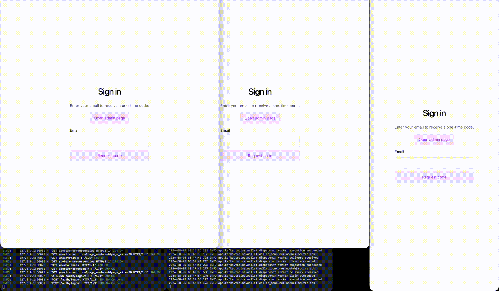

# Clean Architecture Wallet

## Intro

This project presents a wallet code sample. 97.74% AI-coded under human guidance through the SDLC, with human review of docs and code. Frontend side completely crafted by AI with no Human code review.

The project will be built in several versions, gradually incrementing enterprise readiness level:

1. **Synchronous wallet processing** — Python hexagonal API, dockerized PostgreSQL, minimalistic React UI.
2. **Async transaction processing** — Kafka-based command pipeline with data changes notifications.
3. **TBD** code review to clean extra code
4. **TBD** move docker connetion from Plaintext to Sasl-ssl
5. **TBD** database sharding
6. **TBD** kubernetes cluster

## Status

- **Version 1** — implemented.
- **Version 2** — implemented.

Check video:



## Functional requirements

- User should be able to log in with OTP.
- User should be able to view its balances and transactions.
- User should be able to exchange its own assets, transfer to another user, and withdraw to admin wallet.
- Admin should be able to log in with a custom temp dev key.
- Admin should be able to see admin balances and all transactions.
- Admin should be able to deposit initial funds to a user.

## Version boundaries

| Area | Version 1 | Version 2 |
| --- | --- | --- |
| Wallet mutations | Execute synchronously and return completed results. | Submit an operation and return `202 Accepted`; the worker later completes, rejects, or fails it. |
| Balances | Single amount per wallet row. | Pending/rejected amounts per currency. |
| Infrastructure | PostgreSQL. | PostgreSQL, Kafka, outbox relay, and worker. |
| Wallet feedback | Immediate result or error. | Pending operation ID and polling feedback. |
| Diagnostics | Not present. | Not present. |
| Tests | Not present. | Not present. |

## Repository layout

```
project-root/
├── backend/          # Python API (uv, FastAPI, Alembic)
├── frontend/         # React UI (Yarn, Vite)
├── docs/             # Canonical requirements and implementation guides
├── docker-compose.yml
└── README.md
```

## Documentation

One of the first docs created - [Wallet Proposal](docs/archive/proposals/WALLET_SAMPLE_PROPOSAL_0.md). Contains some early stage requirements, gathered in a single file to start AI development from. When Version_1 was implemented, the doc was aligned with the code, and stored in [Wallet Proposal v1-aligned](docs/archive/proposals/WALLET_SAMPLE_PROPOSAL_ALIGNED_V1.md).

Version 1 [Readme.md](docs/archive/v1/README.md) and all the other v1 docs are in `/docs/v1/` folder.

Version 2 [Readme.md](docs/archive/v2/README.md) and all the other v2 docs are in `/docs/v2/` folder.

## Bootstrap and verification

Host processes (`uvicorn`, the Kafka wallet worker, the reaper) read `backend/.env`. Local Kafka is reachable from the host at `127.0.0.1:29092` (`KAFKA_BOOTSTRAP_SERVERS` in `backend/.env.example`). Run the full demo only with `APP_ENV=development`; development-only OTP display, the demo admin credential, and Kafka diagnostics must be disabled in production.

### .env

- copy `backend/.env.example` into `backend/.env`
- copy `frontend/.env.example` into `frontend/.env`
- for some processes, a symlink might exist in the root `.env` to target `backend/.env`

### Terminal 1

Start PostgreSQL, Kafka, topics, migrations, and the API (terminal 1). `kafka-init` is a one-shot job that creates `wallet` (3 partitions) and `wallet_dlq`; it is not started by `up -d kafka` alone:

```sh
cd backend
uv sync --all-groups
cd ..
docker compose --env-file backend/.env up -d postgres
docker compose --env-file backend/.env up -d kafka
docker compose --env-file backend/.env run --rm kafka-init
cd backend
uv run alembic upgrade head
uv run uvicorn app.main:create_app --factory --reload
```

### Terminal 2

Run frontend (terminal 2):

```sh
cd frontend
corepack enable
yarn install --immutable
yarn dev
```

### Terminal 3

Run the command worker that consumes `wallet` (terminal 3). It is a host process (`uv run python -m app.kafka.workers.wallet`), not a Compose service. The worker is the only application consumer; it publishes exhausted or poison failures to `wallet_dlq`. There is no long-running application consumer for `wallet_dlq`.

```sh
cd backend
uv run python -m app.kafka.workers.wallet
```

Optional: inspect `wallet` or `wallet_dlq` with the broker console consumer (does not join `wallet_worker`):

```sh
docker compose --env-file backend/.env exec kafka \
  /opt/kafka/bin/kafka-console-consumer.sh \
  --bootstrap-server kafka:9092 \
  --topic wallet_dlq \
  --from-beginning
```

### Terminal 4 [optional]

The stale-`submitted` reaper (`uv run python -m app.kafka.workers.reaper` from `backend/`) republishes to `wallet`; it does not consume either topic.

```sh
cd backend
uv run python -m app.kafka.workers.reaper
```

### Optional commands

- `docker compose --env-file backend/.env down -v --remove-orphans` - (from the repo root) removes stops postgres/kafka, removes the containers (and their logs), and deletes the postgres_data and kafka_data volumes
- `docker compose --env-file backend/.env up -d --force-recreate kafka` - recreate kafka
