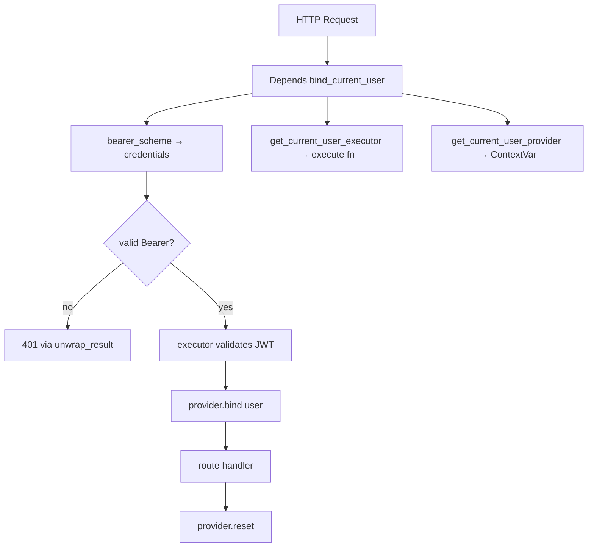

# Python / FastAPI learning notes

Notes from working through layers in this project.

---

## Authentication system design

### `GetCurrentUserExecutor` — reading the brackets

File: `backend/app/api/dependencies.py`

```python
GetCurrentUserExecutor = Callable[
    [GetCurrentUserQuery], Awaitable[Result[CurrentUser]]
]
```

Read it **from the inside out**:

| Piece | Meaning |
|---|---|
| `CurrentUser` | Domain object: authenticated user |
| `Result[CurrentUser]` | Success with a user, or failure with an error code |
| `Awaitable[...]` | You must `await` it — it's async |
| `[GetCurrentUserQuery]` | One argument: the query object (holds the JWT token) |
| `Callable[[...], ...]` | "A function you can call" |

In plain English:

> **A callable that takes a `GetCurrentUserQuery` and, when awaited, returns `Result[CurrentUser]`.**

That matches the inner function in `get_current_user_executor`:

```python
async def execute(query: GetCurrentUserQuery) -> Result[CurrentUser]:
    async with request.app.state.session_factory() as session:
        handler = build_get_current_user_handler(session, request.app.state.settings)
        return await handler.handle(query)
```

`Callable` always uses **two** bracket groups:

```python
Callable[[arg1_type, arg2_type], return_type]
#         ^^^^^^^^^^^^^^^^^^^^^^^^  ^^^^^^^^^^^
#         "what you pass in"        "what you get back"
```

Why not just write `async def ...` inline? The alias names the **shape** of the injected dependency so `bind_current_user` can declare `executor: GetCurrentUserExecutor` without repeating the full generic.

---

### `bind_current_user` — where do those parameters come from?

File: `backend/app/api/dependencies.py`

They are **not** passed by the HTTP client. FastAPI builds them via **dependency injection**: it inspects the function signature and resolves each `Depends(...)` before your route runs.

```python
async def bind_current_user(
    credentials: Annotated[
        HTTPAuthorizationCredentials | None, Depends(bearer_scheme)
    ],
    executor: Annotated[
        GetCurrentUserExecutor, Depends(get_current_user_executor)
    ],
    provider: Annotated[
        ContextVarCurrentUserProvider,
        Depends(get_current_user_provider),
    ],
) -> AsyncIterator[None]:
    ...
    token = provider.bind(current_user)
    try:
        yield
    finally:
        provider.reset(token)
```

Resolution chain:

```
HTTP request
    │
    ├─► bearer_scheme (HTTPBearer)        → parses Authorization: Bearer <token>
    │                                          → credentials (or None)
    │
    ├─► get_current_user_executor(Request)  → returns the async execute() closure
    │                                          (with session/request wired in)
    │
    └─► get_current_user_provider()         → singleton ContextVarCurrentUserProvider
```

What the function does:

1. Reject missing/non-Bearer auth.
2. Call `executor(GetCurrentUserQuery(token=...))` to validate JWT + session.
3. `provider.bind(current_user)` — store user in a `ContextVar` for this request.
4. **`yield`** — hand off to the route handler (or next dependency).
5. **`finally: provider.reset(token)`** — clean up after the request.

The `yield` makes this a **generator dependency**: code before `yield` runs on the way in; code after (here, in `finally`) runs on the way out. That's why the return type is `AsyncIterator[None]` — it yields nothing useful; the side effect (bind/reset) is the point.

`HTTPBearer(auto_error=False)` means a missing header does **not** auto-raise 401; this function checks credentials itself and maps failure through the domain `Result`.

---

### `Annotated[..., Depends(...)]` — what's going on?

File: `backend/app/api/dependencies.py`

Two layers in one annotation:

```python
credentials: Annotated[HTTPAuthorizationCredentials | None, Depends(bearer_scheme)]
#                      ^^^^^^^^^^^^^^^^^^^^^^^^^^^^^^^^^^^^^  ^^^^^^^^^^^^^^^^^^^^^
#                      real Python type (for type checkers)   FastAPI metadata (how to inject)
```

Older equivalent:

```python
credentials: HTTPAuthorizationCredentials | None = Depends(bearer_scheme)
```

Same behavior; `Annotated` keeps **type** and **injection rule** separate — better for mypy/pyright and the modern FastAPI style.

FastAPI reads `Depends(...)` and knows: "Don't take this from the query/body/path — call this function (or use this security scheme) to produce the value."

Nested `Depends` also chains: `get_current_user_executor` needs `Request`; FastAPI injects `Request` into it automatically because `Request` is a known special parameter.

---

### `dependencies=[Depends(bind_current_user)]` on a route

From `backend/app/api/routers/health.py`:

```python
@router.get(
    "/authenticated",
    dependencies=[Depends(bind_current_user)],
)
async def health_authenticated() -> dict[str, str]:
    return {"status": "ok"}
```

This attaches `bind_current_user` at the **route decorator** level.

Two ways to use a dependency in FastAPI:

| Style | Example | Effect |
|---|---|---|
| Parameter | `async def foo(user: CurrentUser = Depends(...))` | Runs dependency **and** passes return value into the handler |
| Route `dependencies=` | `dependencies=[Depends(bind_current_user)]` | Runs dependency **only**; return value is **not** passed to the handler |

Here the handler doesn't need `CurrentUser` in its signature — it only needs auth to succeed. If auth fails, `unwrap_result` raises before the handler runs. If it passes, the handler returns `{"status": "ok"}`.

Flow:

```
GET /health/authenticated + Authorization: Bearer ...
        │
        ▼
bind_current_user runs (before handler)
        │ validate token, bind user to ContextVar
        ▼
health_authenticated() runs
        │
        ▼
bind_current_user cleanup (finally: reset ContextVar)
        │
        ▼
response sent
```

`/health/live` has **no** such dependency — no auth required.

---

### Big picture



**Summary:**

- `GetCurrentUserExecutor` = "async function(query) → Result[user]".
- `bind_current_user`'s parameters come from FastAPI's DI, not the client.
- `Annotated[..., Depends(...)]` splits type vs injection.
- `dependencies=[...]` on the route runs auth as a gate without adding parameters to the handler.
