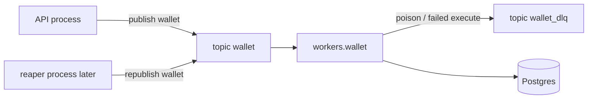

# Phase 3A — Kafka refactoring log

Post-Phase-3 improvements to the Kafka package, worker wiring, and retry mapping. This phase did **not** add wallet transaction types, SSE, or reaper scans.

Phases that already happened (historical; do not treat their file paths or retry counts as current):

- [PHASE_1_KAFKA_INFRASTRUCTURE.md](PHASE_1_KAFKA_INFRASTRUCTURE.md) — broker, topics, settings, first producer adapter, process shells
- [PHASE_2_ASYNC_SCHEMA_STATE_MACHINE.md](PHASE_2_ASYNC_SCHEMA_STATE_MACHINE.md) — schema and status machine
- [PHASE_3_ASYNC_TRANSACTIONS.md](PHASE_3_ASYNC_TRANSACTIONS.md) — submit/execute slices, worker consume pipeline, local retry loop, DLQ

Canonical env contract after this refactor: [CONFIGURATION.md](../v2/CONFIGURATION.md). Working notes used during the work are not the source of truth; **application code is**.

## Current implementation status

- **Implemented.** Layout, producer lifecycle, dispatcher stages, domain naming, and aiokafka 0.14 retry mapping are in `backend/app/kafka/` and `backend/app/config.py`.
- Phases 1–3 are also implemented; their guides remain historical. Where this file disagrees with those records, this file plus the code win.

## Scope

### In scope (recorded here)

- Split `app/kafka/` into **topic packages** vs **process packages**.
- Fix the wallet worker’s two-producer / unstarted DLQ client bug.
- Move execution-registry composition to the wallet worker process.
- Split `RecordDispatcher.dispatch` into stages; keep ACK/DEFER and DLQ-then-DB.
- Map retries to aiokafka 0.14 (time-based inner produce retries; one handler execute per delivery).
- Rename domain/Kafka types so they say “wallet tx message”, not “command envelope”.

### Out of scope

- [PHASE_4_SSE_WALLET_UI.md](PHASE_4_SSE_WALLET_UI.md) and [PHASE_5_REAPER_ADMIN_POLLING.md](PHASE_5_REAPER_ADMIN_POLLING.md) — not updated by this phase.
- Implementing `workers/dlq` replay or reaper scan/republish.
- Deleting `run_until_shutdown` (still present, unused).

---

## 1. Package layout — mixed folders became topics + workers

**Changed from:** Phase 1–3 put process shells (`worker/`, `reaper/`), topic adapters (`messaging/`, later `wallet/` + `dlq/` at the kafka root), and leftover trees (`publishers/`, `dql/`) next to each other. The wallet consume pipeline lived under `app/kafka/worker/` (consumer, dispatcher, retry loop, visibility, execution registry).

**Changed into:** Topic libraries under `topics/` and host processes under `workers/`. Shared client construction stays in `shared/`; process boot and health stay in `runtime/`.

**Because:** Topics (wire format, publish, consume, DLQ write) are libraries used by processes. Processes (wallet worker, reaper, future DLQ worker) are CLI entrypoints. Mixing them made the worker folder both a process and the wallet pipeline, and made it easy to start the wrong producer.

Current tree (paths relative to `backend/app/kafka/`):

```
kafka/
  __init__.py              # façade for API: producer factory + wallet publisher + readiness
  shared/                  # AIOKafkaProducer / AIOKafkaConsumer factories
  runtime/                 # logging, signals, managed producer, readiness checks
  topics/wallet/           # wallet topic: mapper, publisher, consumer, dispatcher, factories
  topics/dlq/              # wallet_dlq topic: mapper, context, publisher, factory
  workers/wallet/          # process: main + execution_registry
  workers/reaper/          # process: idle shell (scan still Phase 5)
  workers/dlq/             # stub process (not a live consumer)
  workers/visibility.py    # submitted-row visibility delay (DB race, not Kafka retries)
```

Deleted leftover packages from the Phase 1 / mid-Phase-3 trees: `messaging/` (codec + producer factories), `publishers/`, typo `dql/`, and the singular `worker/` / `reaper/` / root `wallet/` / `dlq/` packages once their contents moved.

Public façade stayed `app.kafka` so the API does not import topic internals:

```python
# backend/app/kafka/__init__.py
from .topics.wallet.factory_publisher import build_wallet_publisher
from .shared.dependencies import build_aiokafka_producer
```

API composition uses that façade:

```python
# backend/app/dependencies.py
from app.kafka import build_wallet_publisher

def build_message_publisher(
    settings: KafkaSettings,
    producer: AIOKafkaProducer | None = None,
) -> MessagePublisher:
    return build_wallet_publisher(settings, producer=producer)
```

### CLI

**Changed from:** `uv run python -m app.kafka.worker` and `python -m app.kafka.reaper` (Phase 1).

**Changed into:** `uv run python -m app.kafka.workers.wallet` and `python -m app.kafka.workers.reaper`.

**Because:** There is no longer a single generic Kafka worker; the process is the wallet-topic consumer. A DLQ worker stub exists at `app.kafka.workers.dlq` but only returns `0`.

There is no compatibility shim for the old module path.

---

## 2. Execution registry — topic module became worker composition

**Changed from:** `topics/wallet/execution_registry.py` with `build_worker_execution_registry(engine)`. It built a session factory internally (and the consumer built another). `SystemClock()` was constructed once per handler. `factory_consumer` defaulted a missing registry to `ExecutionHandlerRegistry()` (empty), so every type looked like “handler not enabled” poison.

**Changed into:** `workers/wallet/execution_registry.py` with `build_wallet_execution_registry(session_factory, *, clock=None)`. `workers/wallet/main.py` builds `session_factory` once and passes it to both the registry and the consumer. The factory requires a real registry.

**Because:** Registering execute handlers is process DI, not wallet wire format. One session factory and one clock match how the rest of the backend wires handlers.

```python
# backend/app/kafka/workers/wallet/execution_registry.py
def build_wallet_execution_registry(
    session_factory: async_sessionmaker[AsyncSession],
    *,
    clock: ClockService | None = None,
) -> ExecutionHandlerRegistry:
    clock_service = clock if clock is not None else SystemClock()
    registry = ExecutionHandlerRegistry()
    registry.register(
        WalletTxType.DEPOSIT,
        ExecuteDepositHandler(
            session_factory,
            TransactionCommandRepositoryImpl,
            UserWalletCommandRepositoryImpl,
            clock_service,
        ),
    )
    # WITHDRAWAL, EXCHANGE, TRANSFER: same clock_service
    return registry
```

```python
# backend/app/kafka/topics/wallet/factory_consumer.py — registry is required
def build_wallet_consumer(
    *,
    consumer: AIOKafkaConsumer,
    dlq_publisher: DlqPublisher,
    runtime: WorkerRuntime,
    session_factory: async_sessionmaker[AsyncSession],
    shutdown_event: asyncio.Event,
    execution_registry: ExecutionHandlerRegistry,
) -> WalletWorkerConsumer:
    ...
```

Handler constructors still take repository **classes**, not instances — unchanged from Phase 3.

---

## 3. Wallet worker producers — two clients became one started producer

**Changed from:** `run_wallet_worker` called `build_kafka_command_publisher` and `build_dlq_publisher` with no shared `producer=`. Each factory created its own `AIOKafkaProducer`. `WalletWorkerConsumer.start()` started only the **wallet** publisher. `DlqPublisher` had no `start()`/`stop()`, so the DLQ client was never started. Poison `send_and_wait` could fail; because `publish_failure` re-raises, the source offset stayed uncommitted and `wallet_dlq` got nothing. The wallet publisher in this process was unused for business publish (metadata only).

**Changed into:** One `build_aiokafka_producer` in `main`. That instance is passed to `build_dlq_publisher(..., producer=producer)`, started after Postgres/schema checks, used for `check_kafka_topics(..., include_dlq=True)`, and stopped in `finally`. The wallet publisher is **not** constructed in this process. Consumer `start`/`stop` only start/stop `AIOKafkaConsumer`.

**Because:** This process publishes to `wallet_dlq`, not to `wallet`. Readiness can inspect both topics through any started producer. Sharing one client is the only way DLQ publish and topic checks share a lifecycle.

```python
# backend/app/kafka/workers/wallet/main.py (trimmed)
producer = build_aiokafka_producer(runtime.kafka)
dlq_publisher = build_dlq_publisher(runtime.kafka, producer=producer)
wallet_consumer = build_wallet_consumer(
    consumer=build_aiokafka_consumer(
        runtime.kafka,
        runtime.worker,
        runtime.kafka.command_topic,
        runtime.kafka.worker_group_id,
    ),
    dlq_publisher=dlq_publisher,
    runtime=runtime,
    session_factory=session_factory,
    shutdown_event=shutdown_event,
    execution_registry=build_wallet_execution_registry(session_factory),
)
await producer.start()
await wallet_consumer.start()  # consumer.start() only
await check_kafka_topics(producer, runtime.kafka, include_dlq=True)
```

```python
# backend/app/kafka/topics/wallet/wallet_consumer.py
async def start(self) -> None:
    await self._consumer.start()

async def stop(self) -> None:
    await self._consumer.stop()
```

API and reaper still call `build_wallet_publisher()` in **their** processes; they do not share this worker producer.

`DlqPublisher` still has no `start()`/`stop()` — ownership stays in `main`, which is the intended design.

---

## 4. Dispatcher — one long `dispatch` became staged methods

**Changed from:** `RecordDispatcher.dispatch` inlined decode, two identical poison-DLQ blocks (null value vs failed decode), two copy-pasted visibility reloads, claim/lock, `run_with_retries`, DLQ, and terminal DB updates. `WalletTxType(transaction.type)` could raise before poison handling. Success logged `"worker terminal commit succeeded"` after `handler.execute()`, not after a dispatcher commit.

**Changed into:** Public `dispatch` orchestrates helpers. Decode is `_try_parse_record` + `_poison_unreadable`. Load/visibility/type/terminal/submitted is `_observe_transaction`. Execute is `_execute` (single shot; see §6). Unknown stored type is `PoisonExecutionError(SAFE_HANDLER_NOT_ENABLED)`. Success log is `"worker execution succeeded"`.

**Because:** ACK vs DEFER and “DLQ then terminal DB” must stay; the method did not need to be one 120-line procedure. Failed DLQ still must not ACK the source record (`publish_failure` re-raises).

File stayed at `topics/wallet/dispatcher.py` (wallet record processing), while visibility lives in `workers/visibility.py`. That is a deliberate cross-package import: the topic pipeline uses a worker-owned DB-visibility helper.

```python
async def dispatch(self, record: ConsumerRecord[Any, Any]) -> DispatchOutcome:
    key = record.key.decode("utf-8") if record.key is not None else ""
    parsed = self._try_parse_record(record)
    if parsed is None:
        return await self._poison_unreadable(key)

    observation_result_or_tx = await self._observe_transaction(key, parsed, log_extra)
    if isinstance(observation_result_or_tx, DispatchOutcome):
        return observation_result_or_tx

    claimed_or_locked = await self._claim_or_lock(parsed.request_id, observation_result_or_tx)
    if claimed_or_locked is None:
        return DispatchOutcome(action=DispatchAction.DEFER)

    return await self._execute(key, parsed, claimed_or_locked, log_extra)
```

```python
def _try_parse_record(self, record: ConsumerRecord[Any, Any]) -> WalletTxMessage | None:
    if record.value is None:
        return None
    decode_result = WalletTxMsgMapper.from_json(record.value)
    if not decode_result.is_success or decode_result.data is None:
        return None
    return decode_result.data
```

```python
async def _reload_after_visibility(self, request_id: UUID) -> TransactionItem | None:
    await await_submitted_visibility_delay(self._worker_settings)
    return await self._get_by_request_id(request_id)
```

```python
async def _execute_claimed(self, transaction: TransactionItem) -> None:
    try:
        tx_type = WalletTxType(transaction.type)
    except ValueError as error:
        raise PoisonExecutionError(SAFE_HANDLER_NOT_ENABLED) from error
    handler = self._execution_registry.get(tx_type)
    if handler is None:
        raise PoisonExecutionError(SAFE_HANDLER_NOT_ENABLED)
    await handler.execute(transaction)
```

Decode was **not** moved to `wallet_consumer.py`; the dispatcher still takes `ConsumerRecord`. Consumer loop unchanged: commit `{tp: offset + 1}` only on `DispatchAction.ACK`.

Claim helper: `claim_for_execution` **changed into** `update_for_execution` because the SQL is a guarded `pending → in_progress` update, not a generic “claim” verb. Call site in `_claim_or_lock` uses that name. `IN_PROGRESS` still uses `lock_by_request_id`; a lock that is missing or not `in_progress` returns `None` (DEFER).

---

## 5. Domain and mapper names — envelope vocabulary became wallet-tx vocabulary

**Changed from (Phase 1):** `CommandEnvelope`, `CommandType`, `CommandPublisher.publish(..., envelope=...)`, `COMMAND_ENVELOPE_INVALID`, Kafka codec `encode_envelope` / `decode_envelope` / `command_envelope_to_json` / `json_to_command_envelope`, factory `build_kafka_command_publisher` / `KafkaCommandPublisher`.

**Changed into:** `WalletTxMessage`, `WalletTxType`, `MessagePublisher.publish(..., message=...)`, `WALLET_TX_MSG_INVALID` (code) and `WALLET_TX_MESSAGE_INVALID` (safe error string), `WalletTxMsgMapper.to_json` / `from_json`, `build_wallet_publisher` / `KafkaWalletPublisher`. Consumer factory renamed `build_wallet_consumer`. Domain file: `domain/messaging/wallet_tx_message.py`. Port file: `domain/ports/services/message_publisher.py`.

**Because:** The wire payload is a wallet transaction pointer (`request_id`, type, `submitted_at`), not a generic command bus. Names that said “envelope” and “command publisher” hid that.

Wire shape is unchanged:

```python
# backend/app/kafka/topics/wallet/wallet_tx_msg_mapper.py
payload = {
    "request_id": str(message.request_id),
    "type": str(message.msg_tx_type),
    "submitted_at": message.submitted_at.isoformat(),
}
```

```python
class MessagePublisher(Protocol):
    async def publish(self, *, key: str, message: WalletTxMessage) -> None: ...
```

---

## 6. Kafka retry mapping (aiokafka 0.14)

Pinned client remains **aiokafka 0.14.0**. There is **no attempt-count `retries` setting** on `AIOKafkaProducer` or `AIOKafkaConsumer`. Phase 1’s app-level produce loop and Phase 3’s three-attempt worker loop double-retried with the client or retried handler execution that the broker already redelivers.

### 6.1 Producer reliability ([CONFIGURATION.md](../v2/CONFIGURATION.md) §5)

**Changed from:** `KafkaWalletPublisher.publish` looped `max_retries + 1`, classified `KafkaError.retriable`, exponential backoff capped by `KAFKA_PRODUCER_RETRY_BACKOFF_MAX_MS`, and wrapped **each** attempt in `wait_for`. Settings: `KAFKA_PRODUCER_MAX_RETRIES`, `KAFKA_PRODUCER_RETRY_BACKOFF_MAX_MS`. Factory passed those into the publisher.

**Changed into:** One `send_and_wait` per `publish`, bounded by `KAFKA_PRODUCER_DELIVERY_TIMEOUT_MS`. Inner retries stay inside aiokafka (`request_timeout_ms` + fixed `retry_backoff_ms`). Idempotence stays on. Timeout unblocks the caller; it does not abort an already-queued send (keyed `request_id` + DB status make a late ack acceptable).

**Because:** Idempotent produce in 0.14 does not expire batches on request timeout (`_can_retry` keeps going until success, a non-retriable error, or `producer.stop()`). An application attempt loop stacked on that. The delivery bound is the app’s only hard stop.

Kept:

| Variable | Default | Role |
| --- | --- | --- |
| `KAFKA_PRODUCER_REQUEST_TIMEOUT_MS` | `10000` | Broker Produce RPC timeout; also passed to the consumer as request timeout. |
| `KAFKA_PRODUCER_DELIVERY_TIMEOUT_MS` | `30000` | End-to-end `asyncio.wait_for` around one `send_and_wait`; must be ≥ request timeout. |
| `KAFKA_PRODUCER_RETRY_BACKOFF_MS` | `200` | Fixed delay between aiokafka inner produce (and consumer fetch) retries. |

Removed from settings, `backend/.env.example`, and `KafkaSettings`:

- `KAFKA_PRODUCER_MAX_RETRIES`
- `KAFKA_PRODUCER_RETRY_BACKOFF_MAX_MS`

Unchanged guarantees: `acks=all`, `enable_idempotence=true`.

```python
# backend/app/kafka/shared/dependencies.py
def build_aiokafka_producer(settings: KafkaSettings) -> AIOKafkaProducer:
    return AIOKafkaProducer(
        **_build_kafka_client_kwargs(settings),
        acks="all",
        enable_idempotence=True,
        request_timeout_ms=settings.producer_request_timeout_ms,
        retry_backoff_ms=settings.producer_retry_backoff_ms,
    )
```

```python
# backend/app/kafka/topics/wallet/wallet_publisher.py — one send, one deadline
try:
    metadata = await asyncio.wait_for(
        self._producer.send_and_wait(self._topic, key=key_bytes, value=value),
        timeout=self._delivery_timeout_s,
    )
except TimeoutError as error:
    raise self._bounded_timeout(log_context) from error
except KafkaError as error:
    logger.error("kafka publish failed definitively", extra={...})
    raise
```

```python
# backend/app/kafka/topics/wallet/factory_publisher.py
def build_wallet_publisher(...) -> KafkaWalletPublisher:
    return KafkaWalletPublisher(
        producer if producer is not None else build_aiokafka_producer(settings),
        settings.command_topic,
        delivery_timeout_ms=settings.producer_delivery_timeout_ms,
    )
```

`DlqPublisher.publish_failure` was already one-shot `send_and_wait` (no delivery `wait_for`); that stayed.

### 6.2 Worker consumption and execution ([CONFIGURATION.md](../v2/CONFIGURATION.md) §6)

**Changed from:** `retry_loop.run_with_retries` wrapping `_execute_claimed` with `WORKER_MAX_ATTEMPTS` (3) and exponential backoff `WORKER_RETRY_BACKOFF_MS` → `WORKER_RETRY_BACKOFF_MAX_MS`. Poison skipped the loop; retryable infra errors slept while status stayed `in_progress`. Dispatcher called `_execute_with_retries`. Exhausted retries used `attempt_count=max_attempts` on DLQ context.

**Changed into:** `_execute` calls `_execute_claimed` **once**. `backend/app/kafka/workers/retry_loop.py` **deleted**. First failure (poison or any other exception, including `RetryableExecutionError` if a handler still raises it) takes the same terminal DB + DLQ + ACK path. `attempt_count=1` on that execute-failure DLQ context (this delivery’s single execute). Unreadable envelopes still use `attempt_count=0`. Offsets stay manual (`enable_auto_commit=false`). Crash before ACK still redelivers; there is no persisted attempts counter.

**Because:** Kafka redelivery already retries the record. A local attempt budget stacked retries, held the worker in `in_progress` across sleeps, and required max-poll math for a schedule that no longer exists. aiokafka does not retry handler execution.

Kept:

| Variable | Default | Role |
| --- | --- | --- |
| `WORKER_RETRY_BACKOFF_MS` | `500` | Submitted-row visibility wait only (not an execution retry schedule). |
| `WORKER_POLL_TIMEOUT_MS` | `1000` | Poll wait. |
| `WORKER_HEARTBEAT_INTERVAL_MS` | `3000` | Heartbeat; must be below session timeout. |
| `WORKER_SESSION_TIMEOUT_MS` | `30000` | Group session timeout. |
| `WORKER_MAX_POLL_INTERVAL_MS` | `300000` | Must cover polling plus the bounded DLQ publication wait. |

Removed:

- `WORKER_MAX_ATTEMPTS`
- `WORKER_RETRY_BACKOFF_MAX_MS`

`WorkerSettings.submitted_visibility_delay_ms` is **not** a new env var; it aliases `retry_backoff_ms`:

```python
@property
def submitted_visibility_delay_ms(self) -> int:
    """Short bounded delay before classifying a still-``submitted`` row (not an env var)."""
    return self.retry_backoff_ms
```

```python
# backend/app/kafka/topics/wallet/dispatcher.py
async def _execute(...) -> DispatchOutcome:
    try:
        await self._execute_claimed(claimed)
    except PoisonExecutionError as error:
        await self._terminal_poison_failure(..., attempt_count=1)
    except Exception as error:
        await self._terminal_poison_failure(..., attempt_count=1)
    else:
        logger.info("worker execution succeeded", extra=log_extra)
    return DispatchOutcome(action=DispatchAction.ACK)
```

Domain table in `execute_cmd.py` updated to match:

```text
| Retryable infrastructure failure | first attempt is terminal; no in-process retry loop |
| Poison input | terminal failure path; no repeated attempts; no balance mutation |
```

`RetryableExecutionError` remains as a type handlers may raise; the dispatcher no longer runs a retry schedule for it.

Consumer construction now also passes Kafka request timeout and retry backoff so Fetch retries use the same numbers as produce (library defaults were 40000 / 100):

```python
def build_aiokafka_consumer(...) -> AIOKafkaConsumer:
    return AIOKafkaConsumer(
        topic,
        **_build_kafka_client_kwargs(kafka),
        group_id=group_id,
        enable_auto_commit=False,
        heartbeat_interval_ms=worker.heartbeat_interval_ms,
        session_timeout_ms=worker.session_timeout_ms,
        max_poll_interval_ms=worker.max_poll_interval_ms,
        request_timeout_ms=kafka.producer_request_timeout_ms,
        retry_backoff_ms=kafka.producer_retry_backoff_ms,
    )
```

Manual commit policy unchanged:

```python
outcome = await self._dispatcher.dispatch(record)
if outcome.action == DispatchAction.ACK:
    await self._consumer.commit({topic_partition: record.offset + 1})
# DEFER: do not commit
```

### 6.3 Validation invariants ([CONFIGURATION.md](../v2/CONFIGURATION.md) §14)

**Changed from:** `validate_worker_composition` had to cover poll + local retry schedule + DLQ wait.

**Changed into:** max poll covers polling plus the bounded DLQ publication wait only.

```python
def validate_worker_composition(kafka: KafkaSettings, worker: WorkerSettings) -> None:
    worst_case_ms = worker.poll_timeout_ms + kafka.producer_delivery_timeout_ms
    if worker.max_poll_interval_ms <= worst_case_ms:
        raise ValueError(
            "WORKER_MAX_POLL_INTERVAL_MS must cover polling and the bounded DLQ publication wait"
        )
```

Producer invariant: delivery timeout ≥ request timeout (unchanged). Inner retries use `KAFKA_PRODUCER_RETRY_BACKOFF_MS`. Heartbeat still below session timeout. Reaper stale threshold still must exceed the producer delivery bound (`validate_reaper_composition` unchanged in role).

---

## 7. Shared vs runtime vs leftover process helpers

**`shared/`:** Holds `_build_kafka_client_kwargs`, `build_aiokafka_producer`, and `build_aiokafka_consumer`. Phase 1 had `messaging/client_options.py` + `producer_factory.py` + `consumer_factory.py`. Those collapsed here. `build_aiokafka_consumer` is still wallet-worker-shaped (topic, group, worker timeouts) but stays in `shared/` so `workers/wallet/main.py` can construct the client before `build_wallet_consumer`.

**`runtime/`:** Still shared by API + wallet worker + reaper (`configure_process_logging`, `register_shutdown_handlers`, `managed_kafka_producer`, Postgres/schema/topic/group checks). Not merged into `shared/` (client construction) or `workers/` (would hide API health).

**`run_until_shutdown`:** Still defined in `runtime/process.py` but commented out of `runtime/__init__.py`. Reaper inlines `wait_for(shutdown_event.wait(), timeout=interval)` instead. Dead helper, not deleted.

**`check_worker_consumer_group`:** Still in `runtime/readiness.py`; only the wallet worker calls it.

**Reaper:** Moved to `workers/reaper/`. Still an idle shell: starts `build_wallet_publisher` for topic metadata, sleeps on `REAPER_INTERVAL_SECONDS`. Builds `_session_factory` and does not use it (scan is still Phase 5).

**DLQ worker stub:** `workers/dlq/main.py` returns `0`. There is still no application consumer of `wallet_dlq`.

---

## 8. How the pieces run after the refactor

Three processes touch Kafka (same as Phase 1; paths and producer ownership changed):

| Process | Command | Role |
| --- | --- | --- |
| API | FastAPI (`app.main`) | Publishes to `wallet` via `KafkaWalletPublisher`. Uses `runtime` for producer lifespan and `/health/ready`. |
| Wallet worker | `uv run python -m app.kafka.workers.wallet` | Only application consumer. Reads `wallet`, executes handlers once per delivery, writes poison/failed execution to `wallet_dlq` on a producer started in `main`. |
| Reaper | `uv run python -m app.kafka.workers.reaper` | Shell: readiness + idle interval. Does not scan or republish yet. |



Publication path: API/reaper → `publish` → `wait_for` → `send_and_wait` → aiokafka inner retries.

Consumption path: fetched record → `RecordDispatcher` → `_execute` once → success ACK or poison DLQ then terminal DB then ACK; DEFER leaves the offset uncommitted.

---

## 9. Mapping from Phase 1–3 paths to current paths

| Historical (Phase 1 / 3 docs) | Current |
| --- | --- |
| `kafka/messaging/envelope_codec.py` | `kafka/topics/wallet/wallet_tx_msg_mapper.py` |
| `kafka/messaging/producer.py` (`KafkaCommandPublisher`) | `kafka/topics/wallet/wallet_publisher.py` (`KafkaWalletPublisher`) |
| `kafka/messaging/producer_factory.py` | `kafka/shared/dependencies.py` (`build_aiokafka_producer`) + `topics/wallet/factory_publisher.py` |
| `kafka/messaging/consumer_factory.py` | `kafka/shared/dependencies.py` (`build_aiokafka_consumer`) |
| `kafka/worker/main.py` | `kafka/workers/wallet/main.py` |
| `kafka/worker/consumer.py` | `kafka/topics/wallet/wallet_consumer.py` |
| `kafka/worker/dispatcher.py` | `kafka/topics/wallet/dispatcher.py` |
| `kafka/worker/retry_loop.py` | **deleted** |
| `kafka/worker/dlq.py` | `kafka/topics/dlq/` (`dlq_publisher`, `dlq_mapper`, `dlq_context`) |
| `kafka/worker/execution_registry.py` (later under `topics/wallet/`) | `kafka/workers/wallet/execution_registry.py` |
| `kafka/reaper/main.py` | `kafka/workers/reaper/main.py` |
| `python -m app.kafka.worker` | `python -m app.kafka.workers.wallet` |
| `CommandEnvelope` / `CommandPublisher` | `WalletTxMessage` / `MessagePublisher` |
| `claim_for_execution` | `update_for_execution` |

---

## 10. Intentionally unfinished in this phase

- `workers/dlq` is a stub; ops inspection / controlled replay of `wallet_dlq` is unchanged from Phase 1.
- Reaper still does not scan stale `submitted` rows (Phase 5).
- `run_until_shutdown` is unused.
- Dispatcher still coupled to `ConsumerRecord` (decode at the consumer edge was optional and skipped).
- `build_aiokafka_consumer` remains in `shared/` rather than `topics/wallet/factory_consumer.py`.
- Comments in `workers/wallet/main.py` still mention an inlined consumer construction; behavior is correct.
