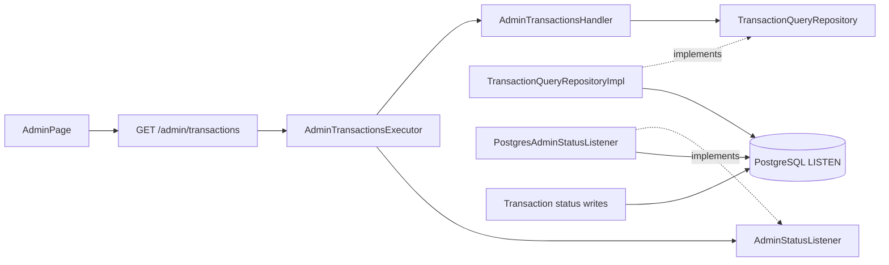

# Phase 5A — Admin transaction long polling

Give administrators a PostgreSQL-backed, cursor-based view of all transactions while using bounded HTTP long polling to surface current status changes. The admin UI keeps one authoritative current row per transaction, but only deposit and withdrawal updates produce admin notifications because those transaction types affect the admin wallet.

This file is the standalone delivery guide and source of truth for admin polling. It resolves the earlier open questions and overrides older Phase 5 wording where that wording requires delivery of every intermediate status version. The current `transactions` table stores only the latest version, so rapid transitions may be coalesced; PostgreSQL snapshots remain authoritative.

The sibling reaper guide is [PHASE_5B_REAPER.md](PHASE_5B_REAPER.md). The two features are independent.

Work in this order:

1. `admin-polling-domain-and-db`
2. `admin-listen-wakeup`
3. `admin-polling-api`
4. `admin-polling-ui`
5. `smoke-check`

Canonical HTTP behavior comes from [API_CONTRACT.md](../v2/API_CONTRACT.md) §`GET /admin/transactions`, [TECHNICAL_REQUIREMENTS.md](../v2/TECHNICAL_REQUIREMENTS.md) §12/§14, [CONFIGURATION.md](../v2/CONFIGURATION.md) §8, and [IMPLEMENTATION_STEPS.md](../v2/IMPLEMENTATION_STEPS.md) §Phase 5. The architecture and notification behavior below are now locked for this codebase.

## Agreed decisions

| Topic | Decision |
| --- | --- |
| Admin data coverage | Poll and maintain the current row for every transaction type across all users: `deposit`, `withdrawal`, `exchange`, and `transfer`. |
| Admin notifications | Show status toasts only for `deposit` and `withdrawal`, and never toast `submitted`. Refresh admin balances only when either type reaches `succeeded`. Exchange and transfer still update the transaction table silently. |
| Delivery guarantee | The admin receives authoritative latest rows ordered by `(updated_at, id)`. Intermediate states may be skipped or coalesced when multiple transitions happen before a query. Duplicate wakeups and repeated rows are expected. |
| Question 5 — read models | Reuse existing `TransactionListRow`, `TransactionListItem`, and `TransactionMapper`. Add only `AdminTransactionCursor(updated_at, transaction_id)` to [`domain/read_models/transaction.py`](../../backend/app/domain/read_models/transaction.py). Do not create a duplicate admin transaction projection and do not import `notifier.StatusCursor` into `domain`. |
| Question 6 — wait mechanism | Use an admin-specific PostgreSQL `LISTEN` wakeup adapter on the existing `transaction_status_changed` channel. It ignores the user-id payload and treats every notification as a wakeup, then re-queries PostgreSQL globally. No periodic DB recheck loop and no row locks. A final query at timeout recovers inserts that do not emit `NOTIFY`. |
| Phase 4 reuse | Reuse the existing channel, same-transaction `pg_notify` emission, asyncpg URL helper, and LISTEN/double-check pattern. Do not reuse `PostgresStatusNotifier` unchanged: its API and repository are user-scoped and its iterator is unbounded. Do not change the Phase 4 user SSE contract. |
| `submitted` inserts | Keep Phase 4 behavior: do not emit `NOTIFY` on insert `submitted`. A long poll already queries before waiting and after timeout, so inserts become visible no later than the configured poll bound. `submitted` rows update the table but never produce a toast. |
| Question 7 — cursor codec | Add a strict admin cursor codec in `backend/app/api/admin_transaction_cursor_codec.py`. Keep `SseStatusEncoder` unchanged because malformed SSE resume IDs intentionally restart silently, while malformed admin cursors return `422 VALIDATION_ERROR`. |
| Question 8 — HTTP contract | Replace only the admin offset endpoint with `cursor`, `limit`, and `timeout_seconds`, returning `{items, next_cursor}`. Remove `page_number`, `page_size`, `total_items`, and “Load more” from the admin flow. Keep `GET /me/transactions` offset-paginated. |
| Source of truth | PostgreSQL is authoritative. LISTEN is only a wakeup optimization; the payload never supplies transaction data. Kafka is not part of the admin read path. |
| Tests and telemetry | AI smoke only; no new automated test files. Metrics remain deferred. Structured logs are allowed. |

## Current implementation status

- **Not started:** there is no admin cursor query, global LISTEN wakeup adapter, bounded long-poll executor, or frontend poll loop.
- Phase 3 duplicate-safe execution and Phase 4 user SSE are implemented.
- Settings already exist: `ADMIN_LONG_POLL_DEFAULT_SECONDS` (25) and `ADMIN_LONG_POLL_MAX_SECONDS` (30) in [`backend/app/config.py`](../../backend/app/config.py).
- `TRANSACTION_STATUS_CHANNEL` already configures the shared status channel.
- Index `ix_transactions_updated_at_id` already exists; current admin offset listing does not use it.
- Existing status writes call `pg_notify` for persisted `pending`, `in_progress`, `succeeded`, and `failed` transitions. The payload is a visible user's UUID. The admin listener deliberately ignores that routing value.

## Purpose

Administrators continuously reconcile the current state of every transaction from PostgreSQL. The UI highlights deposit and withdrawal status changes, refreshes admin balances on their success, and remains correct when notifications are duplicated, statuses are skipped, a request times out, or a connection is interrupted.

## Prerequisites

- [ ] The Phase 4 SSE hard stop gate is green.
- [ ] `ix_transactions_updated_at_id` exists on the target database.
- [ ] The API process can open a dedicated asyncpg LISTEN connection for each active admin long-poll request. Expected concurrency is 1–5 development admin sessions.

## Scope

### In scope

- Global keyset reads over `(updated_at, id)` using existing transaction list projections.
- Strict opaque admin cursor encode/decode.
- Bounded `GET /admin/transactions` long polling with LISTEN-assisted wakeup and timeout reconciliation.
- One dedicated asyncpg LISTEN connection per waiting admin request; no listener for immediate initial or `timeout_seconds=0` reads.
- Admin UI initial catch-up, continuous long-poll loop, monotonic upsert, deposit/withdrawal toasts, and balance refresh on success.
- Existing development-only `X-Admin-Key` authorization.

### Out of scope

- Admin SSE, WebSockets, or Kafka reads.
- Durable delivery of every intermediate status transition or a transaction-status history/outbox table.
- Adding `pg_notify` to `submitted` inserts or changing its payload.
- Changing Phase 4 `StatusNotifier`, `PostgresStatusNotifier`, `StatusEventRepository`, or the user SSE wire contract.
- Changing `GET /me/transactions` pagination.
- Reaper scans or republication.
- Automated test files and metrics.

## Done when

The admin page continuously converges to the latest PostgreSQL state for all transaction types, keeps one row per transaction, shows notifications only for non-`submitted` deposit/withdrawal updates, and refreshes balances only after their successful completion. Long polls return promptly on status wakeups, reconcile unnotified inserts by timeout, and release listener/database resources on completion or disconnect.

## Current code baseline

| Layer | Current path | Current behavior |
| --- | --- | --- |
| Router | [`backend/app/api/routers/admin.py`](../../backend/app/api/routers/admin.py) | `page_number` / `page_size`; returns `TransactionListResponse` with `total_items`. |
| Executor | [`backend/app/api/executors/admin_transactions.py`](../../backend/app/api/executors/admin_transactions.py) | One short `read_session` and one handler call. |
| Handler | [`backend/app/domain/use_cases/admin/admin_transactions_query.py`](../../backend/app/domain/use_cases/admin/admin_transactions_query.py) | Calls `get_all_transactions_page`; maps with `viewer_user_id=None`. |
| Repository | [`backend/app/db/repositories/transaction_query_repository.py`](../../backend/app/db/repositories/transaction_query_repository.py) | Runs `COUNT(*)` plus offset query ordered by `created_at DESC, id DESC`. |
| User notifier | [`backend/app/notifier/adapters/pg_notifier.py`](../../backend/app/notifier/adapters/pg_notifier.py) | Unbounded per-user iterator; filters NOTIFY payload by `user_id`; uses a user-visible status-event repository. |
| UI | [`frontend/src/pages/AdminPage.tsx`](../../frontend/src/pages/AdminPage.tsx) | One-shot load, manual “Load more,” and one refresh after deposit submission. |

## Architecture

Keep the admin transaction read as a domain query and repository operation. Add a small notifier port/adapter that owns the global LISTEN connection. The API executor composes the two: LISTEN first, issue short authoritative queries, wait without a SQLAlchemy session, and close the listener when the bounded request completes.



Layer rules:

- `domain` owns `AdminTransactionCursor`, `AdminTransactionsQuery`, the handler, existing transaction projections, and the repository port. It knows nothing about opaque cursor encoding, timeout waiting, asyncpg, FastAPI, or LISTEN.
- `db` implements the global keyset query using a short SQLAlchemy session. It does not wait or open a LISTEN connection.
- `notifier` owns the framework-free global wakeup port and the asyncpg adapter. It does not query transactions, decode API cursors, or import repository implementations.
- `api` validates parameters, strictly decodes/encodes cursors, and orchestrates bounded polling in the admin executor. It depends on the notifier port, not asyncpg.
- The composition root builds `PostgresAdminStatusListener`, places it on application state as the notifier port, and continues building the existing user `StatusNotifier` separately.
- `frontend` treats responses as snapshots after a cursor, not as a durable event log.

## HTTP contract

### `GET /admin/transactions`

- Authorization: existing development-only `X-Admin-Key`.
- Query parameters:
  - `cursor`: optional opaque string.
  - `limit`: integer 1–100, default 100.
  - `timeout_seconds`: integer 0–`ADMIN_LONG_POLL_MAX_SECONDS`; when omitted, use `ADMIN_LONG_POLL_DEFAULT_SECONDS`.
- A request without `cursor` returns its first available page immediately and never opens a LISTEN connection.
- A request with `timeout_seconds=0` performs one immediate keyset query and never opens a LISTEN connection.
- A request with a cursor and positive timeout opens LISTEN before its first query, returns available rows immediately, otherwise waits only until the original request deadline.
- Query:

```sql
SELECT ...
FROM transactions
WHERE (updated_at, id) > (:updated_at, :id)
ORDER BY updated_at ASC, id ASC
LIMIT :limit
```

- Without a cursor, omit the keyset predicate and return the first ascending page.
- Response is `{ "items": [...], "next_cursor": string | null }`.
- When items are returned, `next_cursor` encodes the final returned row's `(updated_at, id)`.
- On an empty cursor-based response or healthy timeout, echo the input cursor as `next_cursor`.
- `next_cursor` is `null` only when a cursorless initial read has no rows.
- Item fields reuse the existing admin projection: `id`, `request_id`, `type`, `status`, `source_asset`, `dest_asset`, `amount`, `error`, `created_at`, `updated_at`. Omit `direction`.
- Malformed cursor, invalid `limit`, or invalid `timeout_seconds` returns the standard `422 VALIDATION_ERROR` envelope without exposing base64, JSON, datetime, or UUID decoder details.
- `timeout_seconds` is bounded against runtime `StreamingSettings`, not a duplicated hard-coded maximum.

### Cursor format

Use unpadded base64url of compact UTF-8 JSON:

```json
{"updated_at":"<UTC RFC 3339>","id":"<canonical UUID>"}
```

Clients treat the value as opaque. The API codec converts it to/from `AdminTransactionCursor(updated_at, transaction_id)`. Normalize decoded timestamps to UTC and encode timestamps with microseconds and `Z`, matching the existing SSE cursor shape without sharing the SSE decoder's permissive error policy.

## Required LISTEN-assisted poll algorithm

This sequence is a correctness requirement:

1. If `after is None` or `timeout_seconds == 0`, run one short query and return.
2. Compute one monotonic deadline for the whole request. A wakeup must not reset the timeout.
3. Open a dedicated asyncpg connection and register a listener on `TRANSACTION_STATUS_CHANNEL` before the first query.
4. Run the global keyset query in a new short SQLAlchemy session. Close the session before waiting. Return immediately if rows exist.
5. Clear the coalescing wakeup event.
6. Run the query again. This double-check closes the race between the first query and clearing the event. Return immediately if rows exist.
7. Wait for either a NOTIFY wakeup, client disconnect/cancellation, or the remaining deadline.
8. After a wakeup, query again. If no rows exist, treat it as a duplicate/spurious wakeup and repeat clear → double-check → wait using the same deadline.
9. At timeout, run one final query before returning. This is how a `submitted` insert, which emits no NOTIFY, becomes visible within the long-poll bound.
10. In `finally`, remove the listener and close the asyncpg connection. Never keep a SQLAlchemy session or database transaction open during a wait.

The admin callback sets its event for every notification on the channel and ignores the user UUID payload. Duplicate notifications are normal: transfers may notify two visible users, and multiple transitions may coalesce before the query. Event payload data must never be returned to the client.

Race each wakeup wait against a disconnect watcher that checks `Request.is_disconnected()` every 250 ms. Use `asyncio.wait(..., return_when=FIRST_COMPLETED)` with the remaining long-poll deadline, cancel and await the losing task, and execute the same listener cleanup path on disconnect. Do not assume that a normal FastAPI request handler is automatically cancelled when its client disconnects.

## Step 1 — Domain and DB

Update [`backend/app/domain/read_models/transaction.py`](../../backend/app/domain/read_models/transaction.py):

```python
@dataclass(frozen=True, slots=True)
class AdminTransactionCursor:
    updated_at: datetime
    transaction_id: UUID
```

Reuse `TransactionListRow`, `TransactionListItem`, and `TransactionMapper`. Export the cursor through the domain read-model and domain façades.

Replace the offset shape in [`backend/app/domain/use_cases/admin/admin_transactions_query.py`](../../backend/app/domain/use_cases/admin/admin_transactions_query.py):

```python
@dataclass(frozen=True, slots=True)
class AdminTransactionsQuery:
    after: AdminTransactionCursor | None
    limit: int
```

`AdminTransactionsHandler.handle` returns `Result[list[TransactionListItem]]`, calls the new global keyset repository method, and maps every row with `viewer_user_id=None`.

Replace only the admin offset method on [`TransactionQueryRepository`](../../backend/app/domain/ports/repositories/transaction_query_repository.py):

```python
async def list_all_transactions_after(
    self,
    after: AdminTransactionCursor | None,
    limit: int,
) -> list[TransactionListRow]: ...
```

Implement it in [`backend/app/db/repositories/transaction_query_repository.py`](../../backend/app/db/repositories/transaction_query_repository.py) using `_list_item_select()`, the optional tuple keyset predicate, ascending order, and `limit`. Remove the admin `COUNT(*)` query. Do not change `get_user_transactions_page` or its offset behavior.

## Step 2 — Admin LISTEN wakeup

Add [`backend/app/notifier/ports/admin_status_listener.py`](../../backend/app/notifier/ports/admin_status_listener.py) with an async context-managed subscription:

```python
class AdminStatusWakeup(Protocol):
    def clear(self) -> None: ...
    async def wait(self, timeout_seconds: float) -> bool: ...


class AdminStatusListener(Protocol):
    def listen(self) -> AsyncContextManager[AdminStatusWakeup]: ...
```

The concrete [`backend/app/notifier/adapters/pg_admin_status_listener.py`](../../backend/app/notifier/adapters/pg_admin_status_listener.py):

- Uses `asyncpg_connect_kwargs` and `StreamingSettings.transaction_status_channel`.
- Opens and registers the listener on context entry, before handing control back to the executor.
- Uses one `asyncio.Event`; the callback calls `set()` for every channel notification without parsing or filtering the payload.
- Returns `True` when notified and `False` when its bounded wait expires.
- Removes the listener and closes the connection on normal completion, timeout, cancellation, or exception.
- Contains no transaction query, SQLAlchemy session, FastAPI type, or cursor codec.

Export only the port from the notifier façade. Keep concrete adapters internal. Add `build_admin_status_listener(database_url)` in [`backend/app/dependencies.py`](../../backend/app/dependencies.py), construct it in [`backend/app/main.py`](../../backend/app/main.py), and expose it on app state typed as `AdminStatusListener`. Keep the existing user `status_notifier` wiring unchanged.

Do not modify [`backend/app/db/repositories/transaction_command_repository.py`](../../backend/app/db/repositories/transaction_command_repository.py): its current same-transaction status notifications are the required emit side.

## Step 3 — API

Create [`backend/app/api/admin_transaction_cursor_codec.py`](../../backend/app/api/admin_transaction_cursor_codec.py) with strict `encode` and `decode` operations for `AdminTransactionCursor`. An absent cursor maps to `None`; an invalid non-empty cursor is translated by the router into the existing sanitized `RequestValidationError` response. Do not call `SseStatusEncoder.decode_status_event_id`, because its invalid-input policy is intentionally different.

Update [`backend/app/api/executors/admin_transactions.py`](../../backend/app/api/executors/admin_transactions.py):

- Keep the executor as the boundary that obtains a new `read_session` and builds `AdminTransactionsHandler` for each query attempt.
- Accept the decoded `AdminTransactionsQuery` and resolved timeout.
- For immediate reads, call the handler once.
- For waiting reads, obtain `AdminStatusListener` from app state and implement the required LISTEN-first, double-check, bounded wait, final-query, and cleanup algorithm.
- Keep one active deadline and tolerate duplicate/spurious wakeups.
- Propagate failures through the existing `Result`/API error mapping; do not turn a healthy timeout into an error.

Add an admin-specific response schema in [`backend/app/api/schemas/admin.py`](../../backend/app/api/schemas/admin.py):

```python
class AdminTransactionPollResponse(BaseModel):
    items: list[TransactionItemResponse] = Field(default_factory=list)
    next_cursor: str | None = None
```

Update [`backend/app/api/routers/admin.py`](../../backend/app/api/routers/admin.py):

- Replace `page_number` / `page_size` with `cursor` / `limit` / optional `timeout_seconds`.
- Resolve the default and maximum from `request.app.state.streaming_settings`.
- Strictly decode the cursor before constructing `AdminTransactionsQuery`.
- Encode `next_cursor` from the last returned item; echo the input cursor for an empty cursor-based response.
- Keep existing amount formatting and omit `direction`.
- Keep `require_admin_key` unchanged.

Update API/executor/schema façades and `__all__` declarations for the public symbols introduced or renamed.

## Step 4 — Admin UI

Update [`frontend/src/types/admin.ts`](../../frontend/src/types/admin.ts):

```typescript
export type AdminTransactionPollResponse = {
  items: TransactionItem[]
  next_cursor: string | null
}
```

Remove `total_items` from the admin transaction response type only.

Update [`frontend/src/api/adminClient.ts`](../../frontend/src/api/adminClient.ts):

- Replace page-number arguments with `{ cursor, limit, timeoutSeconds, signal }`.
- Omit `cursor` on the first request.
- Support `AbortSignal` so the active long poll is cancelled on unmount, key replacement, authorization loss, or navigation.
- Parse `{items, next_cursor}` and continue using the existing sanitized API error handling.

Update [`frontend/src/pages/AdminPage.tsx`](../../frontend/src/pages/AdminPage.tsx):

1. After a valid admin key loads reference data and balances, start one poll loop. Never run concurrent long polls.
2. Perform initial catch-up with `timeout_seconds=0`: first request without a cursor, then immediate cursor requests until an empty page is returned. Suppress all toasts during this initial catch-up.
3. Enter live mode and issue the next bounded long poll immediately after every data response or healthy empty timeout.
4. Process all items before advancing to `next_cursor`.
5. Upsert by transaction `id` or `request_id`; replace only when `updated_at` is strictly newer and never regress lifecycle status. Keep one row per transaction and render history newest-first even though cursor processing is ascending. An equal or older `(request_id, updated_at, status)` is a duplicate and causes no UI side effect.
6. During live mode, show a toast only when an accepted newer row has type `deposit` or `withdrawal` and status `pending`, `in_progress`, `succeeded`, or `failed`. Copy: `{TYPE} (ID: {xxxx}) moved to {STATE}`, displaying `withdrawal` as `withdraw`.
7. When an accepted newer deposit/withdrawal row first reaches `succeeded`, refetch `GET /admin/balances`. Do not refresh balances again for a duplicate version, merely because the submission endpoint returned `202`, or for exchange/transfer updates.
8. Reuse the Phase 4 toast timing and styles (`VITE_STATUS_TOAST_MS`, newest on top, dismiss button, auto-hide). Skipped statuses produce only the toast for the latest observed status.
9. Retry transient transport failures with bounded backoff. Treat an empty response with an echoed cursor as a healthy timeout.
10. Abort the request, stop retries, and clear sensitive admin state when the admin key is replaced/removed, the page unmounts, or development-only access is unavailable.

Remove offset state, `transactionsTotalItems`, `transactionsPageNumber`, `isLoadingMoreTransactions`, and the “Load more” button. After a deposit returns `202`, keep the acceptance message but let polling observe status and balance changes.

## Step 5 — Smoke check

1. Load the admin page with a valid development key. Confirm initial catch-up uses immediate cursor requests, shows one current row per transaction, and does not replay historical toasts.
2. Submit all four transaction types. Confirm every type updates the table, while only deposit and withdrawal status updates create toasts.
3. Confirm a successful deposit or withdrawal refreshes admin balances; exchange, transfer, `submitted`, and `202 Accepted` do not trigger balance refresh.
4. Start a cursor-based request with no available rows, perform a status transition, and confirm LISTEN wakes the request before timeout and the response comes from the PostgreSQL query.
5. Insert a `submitted` row without a later status notification. Confirm the waiting poll returns it on the final timeout query or the immediately following query, no later than the configured bound, and no toast appears.
6. Trigger rapid transitions and duplicate transfer notifications. Confirm the UI converges to the latest status, tolerates skipped intermediate states, and keeps one row.
7. Use `timeout_seconds=0`; confirm one immediate query and no LISTEN connection. Use a positive timeout; confirm one listener is removed and closed after response.
8. Send a malformed cursor and out-of-range query parameters; confirm `422 VALIDATION_ERROR` without decoder internals.
9. Disconnect or navigate away during a wait; confirm the asyncpg listener connection and any pending task are released promptly.
10. Confirm the admin route remains development-only and `GET /me/transactions` plus user SSE behavior are unchanged.
11. Run `uv run ruff check .`, `uv run ruff format --check .`, and `uv run mypy app` from `backend/`; run `yarn lint`, `yarn typecheck`, and `yarn build` from `frontend/`.

## Migration and rollback

- No schema migration is expected; `ix_transactions_updated_at_id` already supports the keyset query. Verify the index before enabling polling.
- Deploy the API and admin UI contract changes together because the admin endpoint response is intentionally breaking.
- Keep user offset pagination and SSE independently deployable.
- On rollback, stop the admin poll loop before reverting the endpoint. Clients recover from compatibility loss by discarding the cursor and starting a fresh initial catch-up; never reset cursors server-side.
- LISTEN failure must fail the current long-poll request safely; it must not cause the API to return stale event-payload data. The admin can retry or use `timeout_seconds=0` for an immediate authoritative read.

## Admin-update hard stop gate

- [ ] Questions 5–8 are implemented exactly as recorded under Agreed decisions.
- [ ] All transaction types converge to authoritative latest PostgreSQL rows with one UI row per transaction; rapid intermediate statuses may be skipped without regression.
- [ ] Only non-`submitted` deposit/withdrawal updates produce admin toasts, and only their success refreshes admin balances.
- [ ] LISTEN is registered before the first waiting query, the double-check prevents missed wakeups, timeout performs a final query, and no SQLAlchemy transaction remains open while waiting.
- [ ] Duplicate user-targeted NOTIFY payloads do not duplicate rows or notifications.
- [ ] Listener connections and frontend requests close on response, timeout, cancellation, navigation, and authorization loss.
- [ ] Backend and frontend static checks and builds pass.

**Done when:** the admin page continuously reconciles all current transaction rows through bounded PostgreSQL long polling, highlights only admin-wallet transaction updates, and remains correct under duplicate wakeups, skipped states, timeout-only insert discovery, and reconnects. Reaper completion is tracked in [PHASE_5B_REAPER.md](PHASE_5B_REAPER.md).
