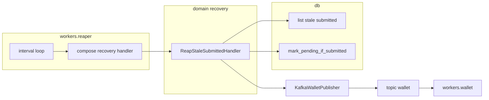

# Phase 5B — Stale-submitted reaper

Close the database-to-Kafka publication gap: a scheduled reaper process finds stale `submitted` rows, republishes the original `WalletTxMessage` onto `wallet`, and lets the existing wallet worker execute. Stale `pending` and `in_progress` rows are alert-logged only — never republished.

This file is the standalone delivery guide for the reaper. Admin polling is [PHASE_5A_ADMIN_POLLING.md](PHASE_5A_ADMIN_POLLING.md). The two features are independent.

Work in this order:

1. `reaper-domain-and-db`
2. `reaper-process`
3. `smoke-check`

Canonical behavior is defined by [TECHNICAL_REQUIREMENTS.md](../v2/TECHNICAL_REQUIREMENTS.md) §8/§14, [CONFIGURATION.md](../v2/CONFIGURATION.md) §7, and [IMPLEMENTATION_STEPS.md](../v2/IMPLEMENTATION_STEPS.md) §Phase 5 (reaper). Kafka layout and retry mapping after Phase 3 are recorded in [PHASE_3A_REFACTORING.md](PHASE_3A_REFACTORING.md). Where that historical wording says `FOR UPDATE SKIP LOCKED` claiming, **this file wins**.

## Current implementation status

- **Not started** (no stale scan, no republication).
- Phase 3 slices **are implemented** (duplicate safety is a prerequisite because reaper republication intentionally permits duplicates). Phase 4 SSE **is implemented**; it is a prerequisite checkbox, not part of this slice.
- The reaper **process shell** already exists after [PHASE_3A_REFACTORING.md](PHASE_3A_REFACTORING.md): [`backend/app/kafka/workers/reaper/main.py`](../../backend/app/kafka/workers/reaper/main.py), CLI `uv run python -m app.kafka.workers.reaper`. It runs readiness, starts `build_wallet_publisher`, and idles; `_session_factory` is built and unused until this phase.
- Settings already loaded: `REAPER_INTERVAL_SECONDS` (30), `REAPER_STALE_THRESHOLD_SECONDS` (60), `REAPER_BATCH_SIZE` (100, 1–1000). `validate_reaper_composition` already requires the stale threshold to exceed `KAFKA_PRODUCER_DELIVERY_TIMEOUT_MS`.
- Index `ix_transactions_status_created_at` exists (Phase 2). Post-ack guard `mark_pending_if_submitted` already exists on `TransactionCommandRepository`.

## Purpose

Recover stale `submitted` work safely. Never republish stale `pending` or `in_progress` — those raise alerts for operational investigation. Execute stays on the wallet worker.

## Agreed decisions (this phase)

These decisions override older Version 2 / original PHASE_5 wording where they conflict. This document is the source of truth for the reaper.

| Topic | Decision |
| --- | --- |
| Process shape | Same **process shell** as [`workers/wallet/main.py`](../../backend/app/kafka/workers/wallet/main.py): runtime, engine, `session_factory`, readiness, shutdown `finally`, plus a process-local composition module. Do **not** copy the wallet consumer or DLQ path. |
| Publish adapter | `build_wallet_publisher` / `KafkaWalletPublisher` (`acks=all`, idempotence, one `send_and_wait` bounded by `KAFKA_PRODUCER_DELIVERY_TIMEOUT_MS`). Same wire payload as the API. No new Kafka format. |
| Scan loop | Every `REAPER_INTERVAL_SECONDS`: bounded `SELECT` of stale `submitted` → reconstruct key + `WalletTxMessage` → `publish` → `mark_pending_if_submitted`. No lock held during the interval sleep. |
| `SKIP LOCKED` | **Not used.** Duplicate publishes are acceptable; wallet execute is already duplicate-safe. |
| Post-ack | After a successful publish, call `mark_pending_if_submitted`. A zero-row result is observe-only, never a forced transition. Leaving the row `submitted` after ack would republish it every interval. |
| Publish failure | Leave the row `submitted` for a later pass; alert-level structured log. |
| Domain package | `backend/app/domain/use_cases/recovery/`. Compose the handler in `workers/reaper/` the way [`execution_registry.py`](../../backend/app/kafka/workers/wallet/execution_registry.py) composes execute handlers. |
| Fetch / publish ownership | The reaper process opens its own sessions from `session_factory` and calls `MessagePublisher.publish` itself. It does not go through the API submission executor. |
| Execute | Unchanged. Wallet worker still consumes `wallet` and runs existing execute handlers once per delivery. |
| Stale `pending` / `in_progress` | Alert-level structured logs only. Never selected for republication. Never release a reservation merely because a row is old. |
| Telemetry | Deferred (same as Phase 4). No metrics. Structured logs correlated by `request_id`. |
| Tests | AI smoke only. No new automated test files. |

## Prerequisites

- [ ] The SSE hard stop gate (Phase 4) is green.
- [ ] All four slices have proven duplicate safety (reaper republication intentionally permits duplicates).
- [ ] `REAPER_STALE_THRESHOLD_SECONDS` exceeds the producer delivery timeout plus expected commit and scheduler jitter (already validated in `validate_reaper_composition`).

## Scope

### In scope

- Domain recovery handler: bounded stale `submitted` selection, `WalletTxMessage`/key reconstruction, publish, post-ack `submitted → pending`.
- Query (or equivalent read) for stale `submitted` plus alert-only stale `pending` / `in_progress` counts.
- Replace the idle loop in `workers/reaper/main.py`. Process-local composition. Readiness and graceful shutdown already sketched by the shell.

### Out of scope

- Repairing stale `pending` / `in_progress` rows (alert only; operational runbook territory).
- Wallet consumer, DLQ worker, or execute-handler changes.
- Admin polling ([PHASE_5A_ADMIN_POLLING.md](PHASE_5A_ADMIN_POLLING.md)).
- Recreating `app/kafka/reaper/` (deleted in Phase 3A).
- Automated tests (deferred).
- Metrics / Prometheus (deferred).

## Done when

Stale `submitted` work is recovered by republication with no double application, and stale later states are alerted rather than republished.

## Architecture

The wallet worker **pulls work from Kafka**. The reaper **pushes missed publishes back onto Kafka**.

```text
API submit  →  insert submitted  →  publish  →  mark_pending
                     │
                     │  crash before publish
                     ▼
              stale submitted
                     │
Reaper tick  →  SELECT  →  publish  →  mark_pending
                     │
                     ▼
              topic wallet  →  workers.wallet execute (unchanged)
```

Layer rules:

- `domain/use_cases/recovery/` — reconstruct and orchestrate one bounded pass. Depends on repository ports and `MessagePublisher`. No aiokafka, FastAPI, or `...Impl`.
- `db` — implement the stale `SELECT` and reuse `mark_pending_if_submitted`. Short sessions; no lock held across the interval sleep.
- `kafka/workers/reaper/` — process DI (session factory, publisher, handler), interval loop, readiness, shutdown. Mirrors `workers/wallet/` as a host process, not as a consumer.



## Step 1 — Domain and DB

Create `backend/app/domain/use_cases/recovery/__init__.py` and `backend/app/domain/use_cases/recovery/reap_stale_submitted.py`.

**Candidate selection:** only `submitted` rows with `created_at < now() - REAPER_STALE_THRESHOLD_SECONDS`. Bound with `REAPER_BATCH_SIZE`. Use `ix_transactions_status_created_at`. This is a **read** `SELECT`, not `SELECT … FOR UPDATE SKIP LOCKED`.

**Message reconstruction:** rebuild the exact original `WalletTxMessage` (`request_id`, stored `WalletTxType` as `msg_tx_type`, original `submitted_at` from `created_at`) and the exact original key from authoritative transaction data: the literal `"admin"` for deposits (`ADMIN_PARTITION_KEY` in submit deposit), the submitting user's UUID string for user commands — resolved from the stored transaction's source/destination wallet ownership, never from a mutable client payload. Publish with `MessagePublisher.publish(*, key, message=...)`.

**One pass:**

1. Bounded `SELECT` of stale `submitted` rows.
2. Alert-only count (or cheap scan) of aged `pending` and `in_progress` — structured alert log, never publish those rows.
3. For each selected row: reconstruct key and message; `publish`; on failure leave `submitted` and log at alert level; on acknowledgement `mark_pending_if_submitted` (zero rows = already moved, observe, do not force).

Extend the **query** port/impl ([`transaction_query_repository.py`](../../backend/app/domain/ports/repositories/transaction_query_repository.py) and its db adapter) with a bounded list of stale `submitted` rows (enough columns to reconstruct key and message) and `count_stale_pending` / `count_stale_in_progress` (alert only).

Reuse existing **command** `mark_pending_if_submitted` — do not add a claim method.

Export the new handler from the `domain` façade the same way other use cases are exported.

## Step 2 — Process and operations

Replace the idle loop in [`backend/app/kafka/workers/reaper/main.py`](../../backend/app/kafka/workers/reaper/main.py). Do not recreate `app/kafka/reaper/`.

Keep the existing shell: `load_reaper_runtime`, logging, engine, `build_session_factory`, `build_wallet_publisher`, readiness (`check_postgres`, `check_schema_revision`, producer start, `check_kafka_topics` on the command topic), shutdown handlers, `finally` stop publisher and dispose engine.

Add a process-local composition module (for example `workers/reaper/recovery.py`) that builds the recovery handler with repository **classes** or a session factory, matching [`build_wallet_execution_registry`](../../backend/app/kafka/workers/wallet/execution_registry.py). `main` currently binds `_session_factory` and never uses it — pass that factory into the handler.

Loop:

- While not shutting down: wait up to `REAPER_INTERVAL_SECONDS` on the shutdown event (same `wait_for` pattern as the idle shell).
- On timeout: run one bounded pass. Do not hold a DB transaction or row lock across the sleep.
- On shutdown: stop accepting new scans; let the active pass (scan or in-flight `send_and_wait`) finish; then close producer and engine.

Publish details:

- Same `request_id`, type, original `submitted_at`, and key the API used — never new identities.
- Worker execute is one attempt per delivery ([PHASE_3A_REFACTORING.md](PHASE_3A_REFACTORING.md)); reaper republish and Kafka redelivery are the retry paths.
- This process does not start a wallet consumer. The command worker remains `uv run python -m app.kafka.workers.wallet`.

Observability: structured logs correlated by `request_id` for candidates, publishes, post-ack no-ops, publish failures, and stale `pending` / `in_progress` alerts. No metrics in this phase. Single local replica is acceptable; document that duplicate publishes from overlapping ticks or a second process are handled by guarded execute, not by `SKIP LOCKED`.

Run command:

```bash
cd backend && uv run python -m app.kafka.workers.reaper
```

## Step 3 — Smoke check

1. **Producer-gap recovery:** stop the API after a `submitted` commit and before publish (or stage a `submitted` row older than the threshold); watch the reaper republish and the command reach exactly one terminal state; inspect the wallet — no double application.
2. **Stale-state discipline:** stage aged `pending` and `in_progress` rows; confirm reaper logs report them and they are never selected for republication.
3. Confirm a successful republish moves the row out of `submitted` via `mark_pending_if_submitted` so the next interval does not republish it unless publication failed.

## Migration and rollback

- The Phase 2 stale-scan index `ix_transactions_status_created_at` is required before enabling the reaper — verify it on the target database first.
- Stop the reaper before any application rollback, database restore, or repair.
- Coordinate any database restore with stopped API intake, worker, and reaper, plus an explicit Kafka offset and retained-command decision.

## Producer-gap hard stop gate

- [ ] Every API crash window exercised in the smoke check is either terminally recorded or recovered by stale-`submitted` republication with no double application.
- [ ] The reaper never republishes a non-`submitted` transaction.
- [ ] `uv run ruff check .`, `uv run ruff format --check .`, `uv run mypy app` pass from `backend/`.

**Done when:** stale `submitted` work is recovered safely and stale later states are alerted rather than republished — completing this half of Version 2 Phase 5. Admin polling is tracked in [PHASE_5A_ADMIN_POLLING.md](PHASE_5A_ADMIN_POLLING.md). The final operations and release gate remains [IMPLEMENTATION_STEPS.md](../v2/IMPLEMENTATION_STEPS.md).
