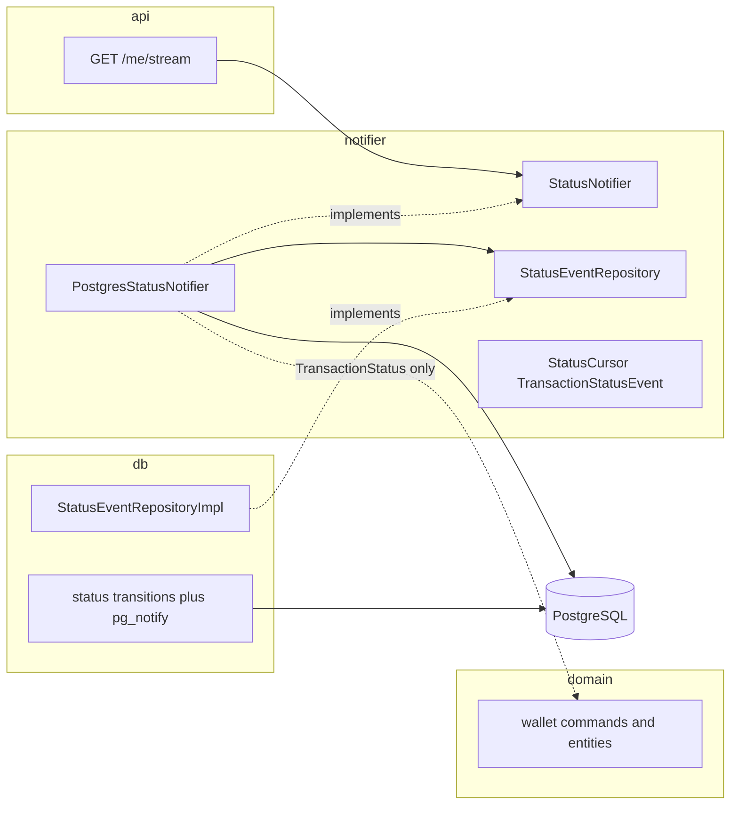

# Phase 4 — User live status with SSE and Wallet UI

Give users secure live transaction-status notifications over Server-Sent Events, with reconnect, resume, and authoritative snapshot reconciliation — replacing Phase 3's manual refresh on the Wallet page.

Work in this order:

1. `notifier-ports-and-read-models`
2. `db-query-and-emit`
3. `notifier-listen-adapter`
4. `sse-endpoint`
5. `ui-streaming-client`
6. `smoke-check`

## Baseline (Phase 3)

Phase 3 remains the mutation and snapshot foundation: all four mutations return `202` with `request_id`, the worker processes all types with duplicate safety, and `GET /me/transactions` is the authoritative user snapshot.

Kafka package layout, naming, and retry mapping after Phase 3 are recorded in [PHASE_3A_REFACTORING.md](PHASE_3A_REFACTORING.md). This phase does not publish or consume Kafka; PostgreSQL remains the stream source. The worker executes **once per delivery** (no local attempt loop), so the live UI may see fewer extra `in_progress` observations before `succeeded` or `failed`. Snapshot reconciliation is unchanged.

If a LISTEN/NOTIFY notifier, `GET /me/stream`, or Wallet live client already exists, replace it so the running system matches this document (standalone `notifier` slice, port injection, and the listen-first plus double-check live loop below). Do not leave a notifier that constructs a SQLAlchemy repository implementation directly.

Canonical behavior is defined by [API_CONTRACT.md](../v2/API_CONTRACT.md) §`GET /me/stream`, [TECHNICAL_REQUIREMENTS.md](../v2/TECHNICAL_REQUIREMENTS.md) §12/§13, [CONFIGURATION.md](../v2/CONFIGURATION.md) §8, and [IMPLEMENTATION_STEPS.md](../v2/IMPLEMENTATION_STEPS.md) §Phase 4.

## Purpose

Users receive secure live status notifications, recover from missed or repeated events through authoritative snapshots, and see correct balances and safe outcomes — while SSE remains a notification channel, never a source of truth.

## Prerequisites

- [ ] The transfer hard stop gate (Phase 3, Slice 4) is green.
- [ ] `GET /me/transactions` exposes `request_id`, `status`, `error`, `updated_at` and ownership filtering including incoming transfers.
- [ ] The implementing agent follows the notifier decision in this document (PostgreSQL `LISTEN/NOTIFY`, standalone hexagonal slice, required subscribe loop). Do not re-open Kafka vs LISTEN vs WebSockets.

## Scope

### In scope

- Standalone `notifier` slice: framework-free read models, driving port (`StatusNotifier`), driven repository port (`StatusEventRepository`), and LISTEN adapter.
- SQLAlchemy implementation of `StatusEventRepository` in `db`, next to domain repository implementations.
- Emit-side `pg_notify` from domain write repositories, in the same transaction as each guarded status transition, for every affected user.
- Authenticated `GET /me/stream` SSE endpoint in `api` with heartbeat, `Last-Event-ID` resume, and clean disconnect handling. `api` depends on `StatusNotifier` only.
- Frontend authenticated streaming client (Bearer header, SSE framing, reconnect, reconciliation) and Wallet page live-status integration.

### Out of scope

- Admin live updates (admin long polling is Phase 5; admin never uses SSE or Kafka reads).
- A Kafka status topic.
- WebSockets.
- Per-user LISTEN channel names.
- Putting event payloads in `NOTIFY` (payload is routing `user_id` only).
- Encoding or decoding `Last-Event-ID` inside `notifier` or `domain`.
- New tables for notifications (PostgreSQL `transactions` plus `LISTEN/NOTIFY` is sufficient).
- Putting status-stream types or ports in core `domain`. Core `domain` stays the wallet.

## Done when

Users receive secure live status notifications, recover from missed or repeated events through authoritative snapshots, and see correct balances and safe outcomes; a forced disconnect/reconnect across rapid status changes reconciles to the PostgreSQL snapshot with no regression or cross-user disclosure.

The notifier slice is wired through its own ports: `api` depends on `notifier.ports.StatusNotifier`; the LISTEN adapter depends on `notifier.ports.StatusEventRepository`; core `domain` does not import `notifier`; SQLAlchemy `...Impl` is constructed only in the composition root (`db` / `dependencies`).

## Architecture rules

- SSE is a notification channel; PostgreSQL remains authoritative; the UI reconciles from `GET /me/transactions` after every connect and reconnect.
- Authentication is enforced before streaming, and every database selection used by the stream is scoped to the authenticated user — a client never receives another user's transaction status.
- Events on the wire carry only `{request_id, status, error?}` plus an opaque event ID; heartbeats are non-semantic comments; no JWTs, emails, or transaction payload data in SSE `data:`.
- Once the `200` SSE response has started, failures close the connection — never append a JSON error envelope to the stream.
- Monotonic client reconciliation: upsert by `request_id`, compare `updated_at` from snapshots, ignore status regressions, tolerate duplicates and skipped observations.
- Disconnect cancellation releases tasks, database sessions, wakeup waiters, and the LISTEN connection promptly.
- Notifications are wakeups. Event fields always come from a user-scoped SQL read, never from the NOTIFY payload beyond routing.

### Hexagonal placement

The app already splits `domain`, `api`, `db`, `auth`, and `kafka`. Live status is a **standalone slice** `notifier`, not a subdirectory of `domain`. Core `domain` remains the wallet (commands, entities, its own ports). `notifier` owns the status-stream read models, ports, and LISTEN adapter. `api` remains the HTTP inbound adapter. `db` is shared infrastructure and may implement driven ports from more than one slice.

```text
backend/app/
  domain/                              # wallet only — no status-stream types
  notifier/
    status_event.py                    # StatusCursor, TransactionStatusEvent
    ports/
      status_notifier.py               # driving: subscribe() for api
      status_event_repository.py       # driven: high-water + list after cursor
    adapters/
      pg_notifier.py                   # LISTEN + catch-up; depends on the repo port
    channel.py                         # channel name, page size (optional)
  api/routers/stream.py                # SSE; depends on StatusNotifier only
  db/                                  # implements StatusEventRepository next to domain repo impls
```

Layer rules:

- `domain` — wallet use cases and ports. No `StatusNotifier`, no `StatusEventRepository`, no `StatusCursor`. No SQLAlchemy, asyncpg, FastAPI, or base64. `domain` must not import `notifier`.
- `notifier` — read models and ports as above. The LISTEN adapter (`PostgresStatusNotifier`) implements `StatusNotifier`, opens the dedicated connection, runs catch-up and live tail, and reads rows **only** through `StatusEventRepository`. May use asyncpg and a SQLAlchemy `async_sessionmaker`. Must not import any `...Impl` or any FastAPI type. Must not encode `Last-Event-ID`. LISTEN is not a repository: the repository port is SQL read-model access only; wakeups stay in the adapter.
- `notifier` may import `TransactionStatus` from `domain` (shared wallet value object). That is the only allowed dependency from `notifier` toward `domain`.
- `db` — SQLAlchemy models; domain repository implementations; `StatusEventRepository` implementation next to them; guarded status updates; `pg_notify` in the same transaction as those updates. No SSE, no LISTEN loop, no cursor encoding.
- `api` — `GET /me/stream`, authentication, opaque cursor encode/decode, SSE framing, heartbeat comments, `retry:` field. Depends on `StatusNotifier`, not on asyncpg, `StatusEventRepository`, or any SQLAlchemy impl.
- Composition root (`backend/app/dependencies.py` and `backend/app/api/dependencies.py`) — constructs the `StatusEventRepository` impl and a `query_repository_factory: Callable[[AsyncSession], StatusEventRepository]`, injects that factory into `PostgresStatusNotifier`, exposes the object as `StatusNotifier` to the router.



### Notifier decision (normative)

Use PostgreSQL `LISTEN/NOTIFY` on channel `transaction_status_changed`, with a database-backed `(updated_at, id)` resume query.

Reason: event order and resume are the same keyset PostgreSQL already maintains for transactions; missed notifications are recovered by catch-up SQL and by client snapshot reconciliation. If the API scales horizontally, each replica opens its own LISTEN connection and serves only its own SSE clients. There is no cross-replica bus and no Kafka status topic, because every stream re-queries the shared database.

Operational limit (accepted for this sample): one dedicated asyncpg connection per SSE client; every listener receives every payload on the shared channel and filters in process by `user_id`. Do not invent per-user channel names in this phase.

### Trusted proxy

Reverse proxies must disable buffering and response compression for `GET /me/stream`, set idle-timeout above `SSE_HEARTBEAT_INTERVAL_SECONDS`, forward `Last-Event-ID`, and skip caching. Application headers are `Content-Type: text/event-stream; charset=utf-8`, `Cache-Control: no-cache, no-transform`, and `X-Accel-Buffering: no`.

## Required subscribe algorithm

This loop is a correctness requirement, not a suggestion. Status notifications fail when a row commits (and NOTIFY fires) while the subscriber is not yet waiting. Combine **LISTEN first** with a **double-check live tail**.

Wakeup primitive: `asyncio.Event`. On a matching notify, `wakeup.set()`. Coalesce duplicate wakeups. Compare payload as `UUID` (parse `str(payload)`; ignore invalid payloads). Do not rely on string formatting of `user_id` matching the emitter by accident.

Subscribe signature must match `async for event in notifier.subscribe(user_id, after)` — **not** `await notifier.subscribe(...)`.

Normative sequence:

1. Open a dedicated asyncpg connection. Register the listener inside `try/finally` that always closes the connection (and removes the listener if the driver requires it).
2. `LISTEN` / `add_listener` **before** high-water or replay.
3. If `after` is set: replay pages after that cursor and yield each event, advancing the cursor. If `after` is `None`: read high-water only (latest visible `(updated_at, id)`, or `None` if the user has no rows). Do **not** replay full history on a fresh connection. Recovery of missed history is `Last-Event-ID` plus `GET /me/transactions`.
4. Live loop (repeat until cancelled):
   - Replay after the current cursor. If any event was emitted, `continue` (do not wait).
   - `wakeup.clear()`.
   - Replay again. If any event was emitted, `continue`.
   - `await wakeup.wait()`.
5. Replay helper: open a **short-lived** session per page via `session_factory`; resolve `StatusEventRepository` through the injected factory; `list_status_events_after`; close the session before yielding the page. Loop while a page is full (`len(page) == page_size`). Stop on a short page. Default `page_size` is 100. Bound every query; use the Phase 2 `(updated_at, id)` cursor index.

Do not:

- Wait-then-query only after high-water (a notify-free gap after LISTEN setup is lost until a later notify).
- LISTEN only after the initial replay, unless the live loop’s first iteration still catch-up-queries (LISTEN-first makes that gap smaller; still keep the double-check).
- Hold one request-scoped SQLAlchemy session for the life of the SSE connection.
- Put cursor datetime encode/decode helpers in `notifier`.
- Copy list-transactions joins (currency/wallet aliases) into the status-event query. The status query is `transactions` plus the existing user-visibility predicate (source or dest wallet belongs to the user).
- Extend the wallet `TransactionQueryRepository` with stream methods. Stream reads go through `StatusEventRepository`. The `db` impl may share a private visibility helper with the wallet query repository so the predicate stays identical.

Pseudocode for the adapter (illustrative; names may match the codebase):

```python
def subscribe(self, user_id: UUID, after: StatusCursor | None) -> AsyncIterator[TransactionStatusEvent]:
    return self._subscribe(user_id, after)

async def _subscribe(self, user_id: UUID, after: StatusCursor | None) -> AsyncIterator[TransactionStatusEvent]:
    connection = await connect_listener(self._database_url)
    wakeup = asyncio.Event()

    def _on_notify(_connection, _pid, _channel, payload) -> None:
        try:
            if UUID(str(payload)) == user_id:
                wakeup.set()
        except ValueError:
            return

    try:
        await connection.add_listener(TRANSACTION_STATUS_CHANNEL, _on_notify)
        cursor = after
        if cursor is not None:
            async for event in self._replay(user_id, cursor):
                cursor = StatusCursor(event.updated_at, event.transaction_id)
                yield event
        else:
            cursor = await self._high_water(user_id)

        while True:
            emitted = False
            async for event in self._replay(user_id, cursor):
                cursor = StatusCursor(event.updated_at, event.transaction_id)
                emitted = True
                yield event
            if emitted:
                continue
            wakeup.clear()
            async for event in self._replay(user_id, cursor):
                cursor = StatusCursor(event.updated_at, event.transaction_id)
                emitted = True
                yield event
            if emitted:
                continue
            await wakeup.wait()
    finally:
        await connection.close()
```

## Step 1 — Notifier ports and read models

Create `backend/app/notifier/status_event.py`:

```python
@dataclass(frozen=True, slots=True)
class StatusCursor:
    """Transparent resume key (updated_at, id). Opaque encoding is an API concern."""

    updated_at: datetime
    transaction_id: UUID


@dataclass(frozen=True, slots=True)
class TransactionStatusEvent:
    request_id: UUID
    status: TransactionStatus
    error: str | None
    updated_at: datetime
    transaction_id: UUID  # used only to build the opaque resume cursor
```

`TransactionStatus` is imported from `domain`. Do not duplicate the enum.

Create `backend/app/notifier/ports/status_notifier.py`. The protocol is a **plain method** returning an async iterator (an async generator is an `AsyncIterator`). Do **not** declare `async def subscribe` — that would mean a coroutine you `await` to obtain the iterator, which does not match `async for notifier.subscribe(...)`.

```python
class StatusNotifier(Protocol):
    def subscribe(
        self, user_id: UUID, after: StatusCursor | None
    ) -> AsyncIterator[TransactionStatusEvent]: ...
```

Document client reconciliation next to the port: monotonic upsert by `request_id`, reject status regressions, tolerate duplicates and skipped observations, treat SSE as hints and `GET /me/transactions` as truth.

Create `backend/app/notifier/ports/status_event_repository.py`:

```python
class StatusEventRepository(Protocol):
    async def list_status_events_after(
        self, user_id: UUID, after: StatusCursor | None, limit: int
    ) -> list[TransactionStatusEvent]: ...

    async def get_status_high_water(self, user_id: UUID) -> StatusCursor | None: ...
```

Visibility must match `GET /me/transactions`: a row is visible when `source_wallet_id` or `dest_wallet_id` is one of the user's wallets (incoming transfers included). Keyset predicate: `(updated_at, id) > (after.updated_at, after.transaction_id)` when `after` is not `None`; order `updated_at ASC, id ASC`; `limit` as given.

`get_status_high_water` returns the latest visible `(updated_at, id)` or `None`.

Export ports and read models from the `notifier` package the same way other slices export their public types. Do not add these types to `domain`.

## Step 2 — DB query and emit

Implement `StatusEventRepository` on a SQLAlchemy adapter in `db`, beside the wallet repository implementations (for example `backend/app/db/repositories/status_event_repository.py`). Keep the query on `TransactionModel` plus the visibility subquery. Do not pull unused currency/wallet joins from the list-transactions query. Do not add these methods to the wallet `TransactionQueryRepository` port.

Keyset SQL shape:

```sql
SELECT … FROM transactions
WHERE visible_to(:user_id)
  AND (updated_at, id) > (:u, :i)   -- omitted when after is NULL
ORDER BY updated_at ASC, id ASC
LIMIT :limit
```

**Emit side** (domain write path, not the LISTEN adapter): every guarded status transition that commits must `SELECT pg_notify('transaction_status_changed', :user_id)` **in the same transaction** as the update. `updated_at` must change in that same transaction (already required by Phase 2 guarded updates).

Notify **every distinct user** who can see the row:

- Deposit / withdrawal / exchange: the owning user.
- Transfer: source user and dest user; if they differ, two notifies. One notify is not enough — the other party’s listener would not wake until some later event.

NOTIFY payload is that user’s id only (string form that `UUID(...)` can parse). Never put `request_id`, status, or error in the payload.

If a later hexagonal refactor wants domain events plus an outbox, that is out of scope: same-transaction `pg_notify` is required so LISTEN cannot fire before the row is committed and visible.

## Step 3 — Notifier LISTEN adapter

Create `backend/app/notifier/adapters/pg_notifier.py`. Channel name and page size may live in `backend/app/notifier/channel.py` (constants only).

```python
TRANSACTION_STATUS_CHANNEL = "transaction_status_changed"
STATUS_EVENT_PAGE_SIZE = 100
```

`PostgresStatusNotifier`:

- Constructor takes `session_factory`, `database_url`, `query_repository_factory: Callable[[AsyncSession], StatusEventRepository]`, and optional `page_size`.
- Implements `StatusNotifier` with the required subscribe algorithm above.
- Parses the SQLAlchemy URL into asyncpg connect kwargs **inside this slice** (small private helper). Do not add unused ISO-datetime helpers here.
- On cancel/disconnect: close the LISTEN connection; do not leak sessions.

Wire in `backend/app/dependencies.py` (composition root), for example:

```python
PostgresStatusNotifier(
    session_factory=...,
    database_url=...,
    query_repository_factory=lambda session: StatusEventRepositoryImpl(session),
)
```

The lambda (or equivalent factory) is the only place `notifier` is allowed to meet `...Impl`. The adapter type-hints `StatusEventRepository`.

## Step 4 — SSE endpoint

Create `backend/app/api/routers/stream.py`. SSE stays in `api`; do not move the router into `notifier/adapters`.

```python
@router.get("/me/stream")
async def stream_transactions(
    current_user: Annotated[CurrentUser, Depends(bind_current_user)],
    last_event_id: Annotated[str | None, Header()] = None,
) -> StreamingResponse:
    ...
```

Behavior, per [API_CONTRACT.md](../v2/API_CONTRACT.md):

- Validate authentication before streaming; on failure return the normal JSON `401 AUTHENTICATION_FAILED`.
- Return `200 OK` with exactly `Content-Type: text/event-stream; charset=utf-8`, `Cache-Control: no-cache, no-transform`, `X-Accel-Buffering: no`.
- Decode `Last-Event-ID` here (unpadded base64url of `{"updated_at","id"}`); absent, expired, or unrecognized IDs start a fresh live stream (`after=None`) without an HTTP error.
- Encode each emitted cursor the same way into SSE `id:`.
- Consume the port with `async for event in notifier.subscribe(current_user.id, cursor)` — never `await subscribe(...)`.
- Emit `event: transaction_status` frames with `id: <opaque cursor>` and `data: {"request_id":"…","status":"…","error":null}`.
- Heartbeats are an **API** concern: send `: keep-alive` comments every `SSE_HEARTBEAT_INTERVAL_SECONDS` (default 15s) even while the notifier is blocked on `wakeup.wait()`. Interleave with `asyncio.wait` / `wait_for` on the next event; do not require the notifier to yield heartbeats.
- Send a `retry: <SSE_RETRY_MILLISECONDS>` field (≥ 3000) once per connection.
- Disable buffering, compression, and caching in the app and document the trusted-proxy requirements (idle timeouts compatible with the heartbeat; forward `Last-Event-ID`).
- On disconnect/cancellation: cancel the `async for` (which must close LISTEN and sessions). On mid-stream error: close the connection without an error envelope.

Wire the router in `backend/app/main.py`; bind `StatusNotifier` in `backend/app/api/dependencies.py` and `backend/app/dependencies.py` following existing patterns.

## Step 5 — UI streaming client

Create `frontend/src/api/streamClient.ts` — native `EventSource` cannot attach a Bearer header, so implement streaming over `fetch`:

- `fetch(`${VITE_API_BASE_URL}/me/stream`, { headers: { Authorization: `Bearer ${token}`, "Last-Event-ID"? } })` and read `response.body` with a `ReadableStream` reader; parse SSE framing (`id:`, `event:`, `data:`, comments) manually with a buffer.
- Never place the JWT in the URL.
- Track the last fully processed event ID; reconnect with it and a bounded retry delay (server `retry:` value, minimum 3000 ms, capped backoff on repeated failures).
- After every initial connection and reconnection, call `GET /me/transactions` and reconcile the snapshot.

Update `frontend/src/pages/WalletPage.tsx`:

- On `transaction_status` events: upsert by `request_id` via `mergeStatus`, tolerate duplicates and skipped states, ignore regressions; render lifecycle status without assuming every intermediate state was observed.
- On `succeeded`: refetch `GET /me/balances` and relevant history.
- On `failed`: clear temporary submission state, refetch authoritative history/balances, display only the safe `error`.
- Show a degraded "live updates unavailable" indicator when disconnected — cached browser state is never presented as authoritative.
- Clean up the stream (abort controller) on unmount and logout.

Update `frontend/src/types/wallet.ts` with the `TransactionStatusEvent` type.

## Step 6 — Smoke check

1. Connect to `GET /me/stream` with a Bearer token (`curl -N -H "Authorization: Bearer …"`), submit a transaction from the UI, and watch `transaction_status` events arrive with plausible payloads and increasing IDs.
2. Disconnect and reconnect with `Last-Event-ID`: the stream resumes or restarts cleanly and the UI reconciles to the authoritative snapshot.
3. Open a second user's stream: it never receives the first user's events; missing/invalid tokens get `401`.
4. Submit a **transfer**: both source and dest users (if different accounts) receive a wakeup and a user-scoped event; neither sees the other user’s unrelated transactions.
5. Submit and observe: balances refresh after a `succeeded` event; no false success is shown from `202` or `pending`.
6. Observe heartbeats during idle (including while no transactions occur) and confirm proxy/browser dev tools show no buffering.
7. Confirm architecture: `domain` does not import `notifier` and has no status-stream ports; `notifier` adapters do not import `StatusEventRepositoryImpl`; `api` stream router does not import asyncpg or the SQLAlchemy query impl.

## Migration and rollback

- Phase 4 adds no authoritative status store; the notifier needs no new table. Any notifier-specific schema change would require its own reviewed migration and rollback analysis (not expected).
- Keep `GET /me/transactions` and history queries fully usable when SSE is disabled or degraded.
- If authorization isolation is ever in doubt, disable SSE immediately (feature switch at router registration) without disabling safe authenticated snapshots.
- Roll back frontend and API SSE changes together when event or resume compatibility changes.

## SSE hard stop gate

- [ ] A forced disconnect and reconnect across rapid status changes reaches the correct PostgreSQL snapshot with no regression or cross-user disclosure.
- [ ] The SSE smoke check covers reconnect, skipped states, duplicates, cross-user isolation, and transfer notify-both-parties without anomalies.
- [ ] Hexagonal smoke: status-stream ports and read models in `notifier/`; LISTEN adapter in `notifier/adapters` depending on `StatusEventRepository`; SQL and `pg_notify` in `db`; SSE/cursor encoding in `api`; `domain` unchanged aside from write-path `pg_notify`.
- [ ] Operational telemetry reports connections, disconnects, resume outcomes, notifier lag, and reconciliation failures without high-cardinality metric labels.
- [ ] `uv run ruff check .`, `uv run ruff format --check .`, `uv run mypy app` pass from `backend/`; `yarn lint`, `yarn typecheck`, `yarn build` pass from `frontend/`.
